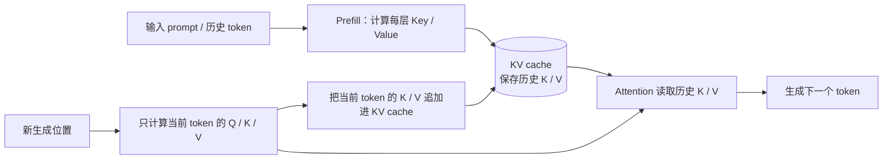
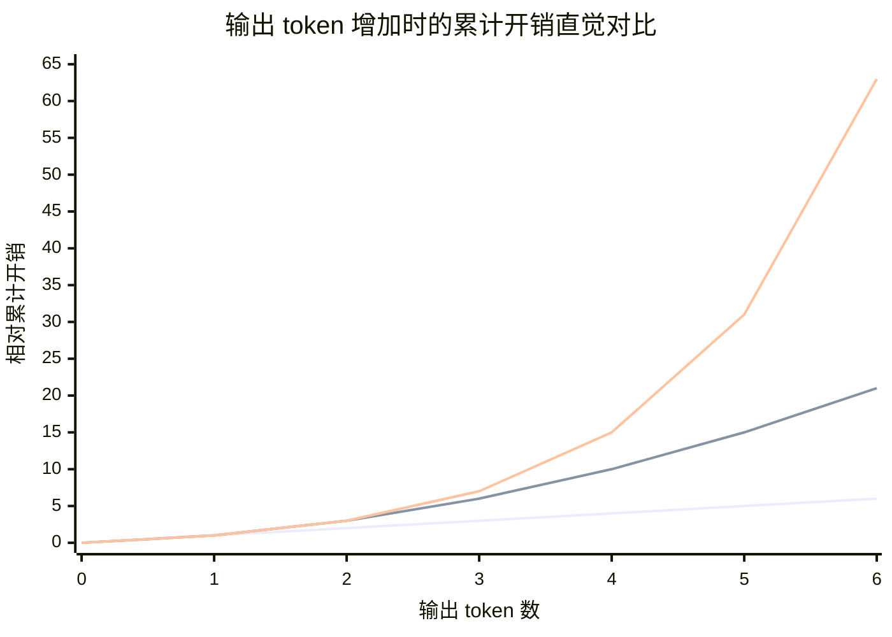
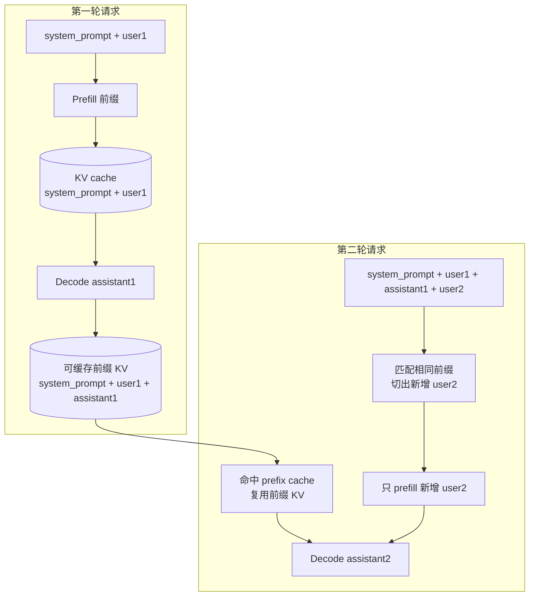
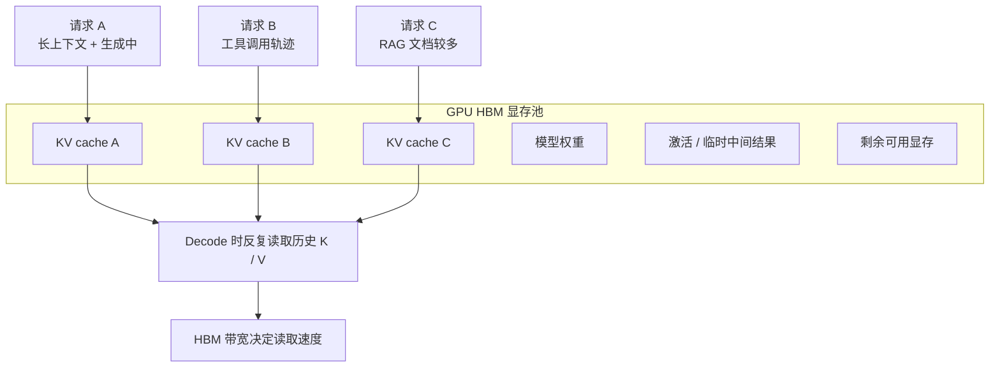

# 6. KV Cache 与 HBM

## 学习目标

这篇文档帮助你理解一个经常被忽略、但非常影响真实推理成本的问题：

**大模型推理不只依赖参数规模和 GPU 算力，也高度依赖 KV cache 与显存带宽。**

学完后你应该能够：

1. 解释 KV cache 在 Transformer 自回归生成中解决什么问题
2. 理解 HBM 为什么会影响长上下文推理的吞吐、延迟和并发
3. 区分 prefill 和 decode 两个推理阶段的主要压力
4. 说明输出 token 越多时，KV cache 的累计收益为什么更明显
5. 区分普通 KV cache 与 prefix cache 分别优化什么
6. 在 Agent、RAG 和长上下文应用中具备缓存与显存预算意识

## 目录

1. [背景：为什么要关心推理缓存](#1-背景为什么要关心推理缓存)
2. [什么是 KV Cache](#2-什么是-kv-cache)
3. [输出 Token 越多，KV Cache 收益为什么越明显](#3-输出-token-越多kv-cache-收益为什么越明显)
4. [KV Cache 优化 Decode，Prefix Cache 优化 Prefill](#4-kv-cache-优化-decodeprefix-cache-优化-prefill)
5. [为什么 Agent 场景更依赖 KV Cache](#5-为什么-agent-场景更依赖-kv-cache)
6. [什么是 HBM](#6-什么是-hbm)
7. [KV Cache 与 HBM 的关系](#7-kv-cache-与-hbm-的关系)
8. [为什么 HBM 会成为 Agent 推理瓶颈](#8-为什么-hbm-会成为-agent-推理瓶颈)
9. [PagedAttention：KV Cache 管理的典型优化](#9-pagedattentionkv-cache-管理的典型优化)
10. [FlashAttention：减少 HBM 访问也是关键方向](#10-flashattention减少-hbm-访问也是关键方向)
11. [工程实践建议](#11-工程实践建议)
12. [练习题](#12-练习题)
13. [总结与下一步](#13-总结与下一步)
14. [参考资料](#14-参考资料)

---

## 1. 背景：为什么要关心推理缓存

大模型 Agent 能够连续对话、读取上下文、调用工具并保留任务状态，背后依赖的不只是模型参数和 GPU 算力，还依赖推理阶段的缓存机制。

其中最关键的一类缓存是 `KV cache`。它保存 Transformer 注意力计算中已经生成过的 Key 与 Value，避免模型在后续生成 token 时重复计算历史上下文。

最近被频繁讨论的 `HBM`（High Bandwidth Memory，高带宽内存）也与此直接相关：KV cache 通常放在 GPU 显存中，而现代 AI GPU 的显存主要由 HBM 提供。Agent 上下文越长、并发越高，KV cache 占用越大，对 HBM 容量和带宽的压力也越大。

可以先用一句话概括：

**KV cache 是大模型推理提速的关键缓存数据，HBM 是承载这些缓存并提供高速读写能力的关键硬件资源。**

---

## 2. 什么是 KV Cache

Transformer 的自注意力机制会把 token 投影成三类向量：

- `Query`：当前 token 用来查询上下文的信息
- `Key`：历史 token 提供的索引信息
- `Value`：历史 token 提供的内容信息

大模型生成文本时是自回归过程。每生成一个新 token，都要参考前面已经出现过的 token。

如果没有 KV cache，模型每生成一个新 token，都需要重新计算历史上下文中所有 token 的 Key 和 Value。上下文越长，重复计算越严重。

KV cache 的做法是：

1. 在处理 prompt 或历史 token 时，计算并保存每一层 attention 的 Key/Value
2. 生成下一个 token 时，只计算新增 token 的 Query/Key/Value
3. 新 token 的 Query 直接访问历史缓存中的 Key/Value

因此，KV cache 把大量重复计算变成了缓存读取，显著降低 decode 阶段的计算量。

可以用下面这张图理解一次 decode 的过程：



这张图最重要的是看清楚两条路径：

- 历史 token 的 Key/Value 进入 KV cache 后，后续步骤主要是读取，而不是重新计算。
- 新 token 生成后，它自己的 Key/Value 也会追加进 KV cache，成为下一步生成时的历史上下文。

---

## 3. 输出 Token 越多，KV Cache 收益为什么越明显

KV cache 的收益会随着输出 token 数增加而变得更明显。

原因是：自回归生成不是一次性生成整段答案，而是一个 token 一个 token 往后接。第 1 个输出 token 只需要参考 prompt；第 100 个输出 token 则要参考 prompt 和前面 99 个已经生成的 token。

如果没有 KV cache，模型每生成一个新 token，都要重新计算“prompt + 已生成内容”的 Key/Value。输出越长，被重复计算的历史越多，累计开销会快速弯曲上升。

有了 KV cache 后，历史 token 的 Key/Value 只需要计算一次，后续生成主要是读取缓存并追加新 token 的缓存。因此输出 token 越多，被避免的重复计算越多，KV cache 的累计收益越明显。

这里要注意一个常见误解：

**这不是指数级提升，更准确地说，是把没有缓存时更接近二次增长的重复计算，压回更接近线性增长的增量计算。**

可以用一个简化例子理解。假设 prompt 长度固定为 100 个 token，模型继续生成 5 个 token，只看“历史 Key/Value 计算量”的相对变化：

| 生成第几个输出 token | 没有 KV cache：需要重新处理的历史长度 | 有 KV cache：新增计算量 |
| --- | ---: | ---: |
| 1 | 100 | 1 |
| 2 | 101 | 1 |
| 3 | 102 | 1 |
| 4 | 103 | 1 |
| 5 | 104 | 1 |
| 累计 | 510 | 5 |

上表里的数字只是帮助建立直觉，真实推理还包含 attention 读取、矩阵计算、batch 调度和硬件实现差异。但它说明了一个关键点：

**没有缓存时，长输出会不断重复处理越来越长的历史；有缓存时，每一步主要只为新增 token 付出增量成本。**

从增长曲线看，可以把线性、二次和指数放在同一张图里对比。第 1 个输出 token 时差距还不明显；从第 2 个输出 token 开始，无缓存的重复计算就会和有缓存的增量计算逐步拉开。这里的指数曲线只是参照物，用来说明“不应该把 KV cache 的收益说成指数级提升”：



也可以用下面这张表区分“线性、二次、指数”：

| 增长类型 | 直觉 | 在 KV cache 语境中的含义 |
| --- | --- | --- |
| 线性增长 | 多生成 1 个 token，大致多付出 1 份增量成本 | 有 KV cache 后，decode 更接近这种直觉 |
| 二次增长 | 越往后，每一步要重复处理的历史越长，累计开销弯曲上升 | 没有 KV cache 时，重复计算会更接近这种直觉 |
| 指数增长 | 每增加一步都按倍数爆炸 | 这不是 KV cache 场景的主要描述，不建议这样表述 |

所以更严谨的表达是：

**输出 token 越多，KV cache 避免的重复计算越多，累计收益越明显；但它不是把指数增长变成线性增长，而是把更接近二次增长的重复计算压力，压到更接近线性增长的增量生成压力。**

---

## 4. KV Cache 优化 Decode，Prefix Cache 优化 Prefill

前面讲的普通 KV cache，主要优化的是**同一次请求内的 decode 阶段**。

但多轮对话里还有另一个常见优化：`prefix cache` 或 `prompt cache`。它优化的是**后续请求里的 prefill 阶段**。

这两个概念容易混在一起，可以先用表格区分：

| 机制 | 作用范围 | 主要优化阶段 | 核心收益 |
| --- | --- | --- | --- |
| 普通 KV cache | 同一次请求内部 | Decode | 生成下一个 token 时不用反复重算历史 Key/Value |
| Prefix cache / prompt cache | 多次请求之间 | Prefill | 相同前缀不用再次完整 prefill，可以复用已算过的前缀 KV |
| HBM | 硬件资源层 | Prefill 与 Decode 都相关 | 决定 KV cache 放得下多少、读写能有多快 |

### 4.1 为什么整体输入变了，前缀 KV 还能复用

假设第一轮对话结束后，上下文是：

```text
system_prompt + user1 + assistant1
```

第二轮用户输入新问题后，请求变成：

```text
system_prompt + user1 + assistant1 + user2
```

直觉上看，第二轮的整体输入确实变了。如果每次都做普通全量 prefill，就会重新计算整段输入的 Q/K/V。

但大多数对话 LLM 是 `decoder-only causal Transformer`，它的注意力规则是：

```text
第 i 个 token 只能看自己和前面的 token，不能看后面的 token。
```

因此，在第二轮里追加 `user2` 不会反向影响前缀：

```text
system_prompt + user1 + assistant1
```

这段前缀的 Key/Value 只依赖前缀本身，不依赖后面新追加的 `user2`。这就是 prefix cache 能复用前缀 KV 的理论基础。

可以用下面这张图理解：



这张图表达的是：

- 第一轮结束后，服务端如果保留了 `system_prompt + user1 + assistant1` 的 KV，就有机会作为第二轮的前缀缓存。
- 第二轮不是完全不计算，而是可以复用相同前缀，只计算新增的 `user2`，再进入 decode 生成 `assistant2`。
- 如果服务端没有保存缓存，或者前缀 token 不完全一致，就仍然需要重新 prefill。

### 4.2 为什么这不是 Encoder 复用

这里不要把 prefill 理解成 BERT 那类双向 encoder 的 encode。

如果是双向 encoder，前面的 token 可以看后面的 token。整体输入一变，前面 token 的表示也可能变化，前缀结果就不能这样直接复用。

但 decoder-only causal Transformer 不一样：

```text
prefix 的计算结果只依赖 prefix 自己
suffix 的计算结果依赖 prefix + suffix
```

所以更准确的说法是：

**普通 KV cache 解决 decode 中的历史重复计算；prefix cache 把 KV cache 的复用范围扩展到多次请求之间，从而减少相同前缀的 prefill 成本。**

### 4.3 Prefix Cache 的成立条件

前缀复用不是无条件发生的，需要同时满足一些工程条件：

- 推理服务支持 `prefix cache`、`prompt cache` 或会话级 KV cache
- 缓存已经启用，并且没有被驱逐
- 前缀 token 序列完全一致
- 前缀位置一致
- 新内容追加在前缀后面，而不是插入或改写中间内容
- 推理引擎的调度策略允许命中和复用这段缓存

所以固定 system prompt、工具 schema、项目背景的价值是：

**提高 prefix cache 命中的可能性，而不是保证一定提速。**

---

## 5. 为什么 Agent 场景更依赖 KV Cache

普通问答可能只有几轮短上下文，但 Agent 场景通常会携带更多内容：

- system prompt
- 工具定义和参数 schema
- 历史对话
- 任务计划和执行轨迹
- 检索到的文档
- 代码、日志、网页内容
- 工具调用结果

这些内容都会进入模型上下文。上下文越长，KV cache 越大。

对 Agent 来说，KV cache 的价值主要体现在两点：

- **单次生成更快**：历史 token 的 Key/Value 不需要重复计算。
- **稳定前缀有机会复用**：如果推理服务支持并命中 prefix cache 或 prompt cache，固定的 system prompt、工具 schema、项目背景等前缀才可能跨请求复用，降低首 token 延迟和计算成本。

这里要特别注意：**固定前缀本身不等于一定提速，也不等于一定复用第一轮的 KV cache。** 如果服务端是无状态请求，或者没有启用 prefix cache，或者前缀 token 序列没有完全匹配，那么第二轮请求通常仍然需要重新 prefill。固定前缀的工程价值是提高缓存命中的可能性，而不是保证一定使用 KV cache。

vLLM 的文档介绍了 PagedAttention 的核心思路：将每个请求的 KV cache 切分为 KV blocks，并通过块级管理支持缓存复用与自动前缀缓存。参考：[vLLM Automatic Prefix Caching](https://docs.vllm.ai/en/v0.6.5/automatic_prefix_caching/details.html)

---

## 6. 什么是 HBM

HBM 全称 `High Bandwidth Memory`，即高带宽内存。它通常与 GPU 或 AI 加速器封装在一起，通过更宽的数据通路提供远高于传统内存的带宽。

HBM 的核心特点是：

- 带宽高
- 距离计算单元近
- 单位功耗下吞吐能力强
- 成本高，供应链复杂
- 容量仍然是稀缺资源

以 NVIDIA H100 为例，NVIDIA 官方规格中列出了 H100 SXM 的 80GB GPU memory 与 3.35TB/s GPU memory bandwidth，H100 NVL 则为 94GB 与 3.9TB/s。参考：[NVIDIA H100 GPU](https://www.nvidia.com/en-eu/data-center/h100/)

这类规格说明，大模型系统性能不只取决于 Tensor Core 的峰值算力，也取决于 HBM 能否持续把数据喂给计算单元。

---

## 7. KV Cache 与 HBM 的关系

KV cache 通常存放在 GPU 显存中，而 AI GPU 的显存主要就是 HBM。

因此两者的关系非常直接：

- HBM 容量决定能放多少 KV cache
- HBM 带宽决定读取 KV cache 的速度
- KV cache 越大，显存占用越高
- 上下文越长，每步 decode 读取的历史 Key/Value 越多
- 并发请求越多，多个请求的 KV cache 会同时挤占 HBM

大模型推理通常分为两个阶段：

| 阶段 | 作用 | 主要压力 |
| --- | --- | --- |
| Prefill | 处理输入 prompt，生成初始 KV cache | 计算密集，prompt 越长越重 |
| Decode | 逐 token 生成输出，反复访问历史 KV cache | 内存带宽敏感，长上下文下尤其明显 |

下面这张图可以帮助理解 KV cache 为什么会直接压到 HBM 上：



这张图要表达两个点：

- **容量压力**：每个活跃请求都有自己的 KV cache，请求越多、上下文越长，占用 HBM 越多。
- **带宽压力**：decode 阶段每生成一个 token 都要读取历史 Key/Value，长上下文会增加 HBM 读压力。

在 decode 阶段，模型通常一次只生成一个 token。此时矩阵计算规模相对小，但每一步都需要读取历史上下文对应的 KV cache。上下文越长，读 HBM 的数据量越大。

这也是为什么长上下文推理中，瓶颈经常不只是 GPU 算力，而是 HBM 容量和带宽。

---

## 8. 为什么 HBM 会成为 Agent 推理瓶颈

Agent 场景会同时放大三个因素。

### 8.1 上下文长度增加

工具调用轨迹、检索文档、代码片段和历史消息都会拉长上下文。KV cache 大小与上下文长度近似线性相关。

### 8.2 并发请求增加

服务端通常需要同时服务多个用户或多个 Agent。每个活跃请求都有自己的 KV cache，占用会叠加。

### 8.3 长输出和多轮循环增加

Agent 往往会经历多次“思考、调用工具、观察结果、继续生成”的循环。KV cache 不只在单轮生成中重要，也会影响多轮请求的吞吐与延迟。

当 HBM 不够时，系统可能需要：

- 降低 batch size
- 缩短上下文窗口
- 减少并发
- 将部分 KV cache 卸载到 CPU 内存
- 对 KV cache 做量化或压缩
- 使用分页式缓存管理

这些方案可以缓解容量压力，但通常会引入额外延迟或实现复杂度。

---

## 9. PagedAttention：KV Cache 管理的典型优化

KV cache 不只是“缓存起来”这么简单，还涉及如何分配、复用和释放显存。

传统连续分配方式容易出现两个问题：

- 不同请求长度不同，预留空间容易浪费
- 请求动态增长和结束后，显存容易碎片化

vLLM 提出的 PagedAttention 借鉴操作系统虚拟内存和分页思想，把 KV cache 切成块进行管理，从而减少碎片和重复复制。

PagedAttention 论文指出，大模型服务的高吞吐依赖足够大的 batch，但每个请求的 KV cache 很大且动态变化；如果管理不当，会因碎片和重复复制浪费显存，限制 batch size。vLLM 通过 PagedAttention 实现接近零浪费的 KV cache 管理，并支持请求内和请求间共享 KV cache。参考：[Efficient Memory Management for Large Language Model Serving with PagedAttention](https://arxiv.org/abs/2309.06180)

这说明大模型推理优化已经不仅是模型算法问题，也越来越像系统工程问题，涉及显存分配、分页、调度、缓存复用和内存层级设计。

---

## 10. FlashAttention：减少 HBM 访问也是关键方向

FlashAttention 是另一个与 HBM 强相关的优化方向。

标准 attention 会产生较大的中间矩阵。如果频繁把中间结果写入 HBM，再从 HBM 读回，性能会被内存 IO 拖慢。

FlashAttention 的核心思想是 IO-aware：通过分块计算减少 GPU HBM 与片上 SRAM 之间的数据读写。论文明确指出，FlashAttention 使用 tiling 来减少 HBM 与 GPU on-chip SRAM 之间的 memory reads/writes。参考：[FlashAttention: Fast and Memory-Efficient Exact Attention with IO-Awareness](https://arxiv.org/abs/2205.14135)

这与 KV cache 优化指向同一个事实：

**大模型推理性能越来越受数据搬运影响，不能只看峰值算力。**

---

## 11. 工程实践建议

在设计 Agent 或长上下文推理服务时，需要把 KV cache 当作一等资源管理。

关键关注点包括：

- **上下文控制**：不要无限保留历史消息，必要时做摘要、裁剪或分层记忆。
- **前缀复用**：固定 system prompt、工具 schema、项目背景等应尽量稳定，但这只是提高 prefix cache 命中概率；真正提速依赖推理服务是否支持并启用缓存、前缀 token 是否完全一致，以及缓存是否仍在服务端保留。
- **并发调度**：长上下文请求和短上下文请求的显存占用差异很大，调度时不能只按请求数估算。
- **缓存管理**：优先使用成熟推理引擎的 paged KV cache、prefix cache、continuous batching 等能力。
- **硬件选型**：长上下文、高并发场景要重点看 HBM 容量和带宽，而不是只看 GPU 算力指标。
- **成本估算**：KV cache 会影响最大并发、token 生成速度和单 token 成本，需要纳入容量规划。

---

## 12. 练习题

### 12.1 判断题

“KV cache 的主要作用是减少自回归生成时对历史 Key/Value 的重复计算。”

参考答案：

正确。KV cache 保存历史 token 在各层 attention 中的 Key/Value，使后续生成可以读取缓存，而不是反复重算整段历史。

### 12.2 思考题

为什么 Agent 比普通短问答更容易遇到 HBM 容量和带宽压力？

参考思路：

Agent 通常会携带 system prompt、工具 schema、历史轨迹、检索资料和工具结果，上下文更长；同时服务端还可能有高并发请求，每个请求的 KV cache 会叠加占用 HBM。

### 12.3 思考题

为什么说 KV cache 的收益会随着输出 token 数增加而更明显，但不应该说成“指数级提升”？

参考思路：

因为没有 KV cache 时，越往后生成，每一步越会重复处理更长的历史上下文，累计开销更接近二次增长；有 KV cache 后，历史 Key/Value 只计算一次，后续更接近线性追加。这里的区别主要是二次增长和线性增长，不是指数增长和线性增长。

### 12.4 思考题

为什么第二轮对话整体输入发生变化后，仍然可能复用第一轮里相同前缀的 KV cache？

参考思路：

因为主流对话 LLM 通常是 decoder-only causal Transformer，前缀 token 不能看到后面新追加的 query。只要前缀 token 序列完全一致，前缀 Key/Value 不会因为后缀变化而改变，所以服务端在支持并命中 prefix cache 时，可以复用前缀 KV，只为新增 query 做 prefill。

### 12.5 实战题

如果一个 Agent 应用在高并发下首 token 延迟明显升高，你会从哪些角度排查？

参考思路：

可以先看 prompt 是否过长、固定前缀是否稳定、prefix cache 是否命中、推理引擎是否支持 paged KV cache、长短请求是否混批合理、HBM 使用率是否接近上限。

---

## 13. 总结与下一步

KV cache 通过复用历史 token 的 Key/Value，避免 Transformer 在自回归生成中重复计算历史上下文，因此能显著提升大模型推理速度。

输出 token 越多，这种复用的累计收益越明显。准确说，它不是“指数级提升”，而是把没有缓存时更接近二次增长的重复计算压力，压到更接近线性增长的增量生成压力。

普通 KV cache 主要优化同一次请求里的 decode；prefix cache 则把 KV 复用扩展到多次请求之间，用来减少完全相同前缀的 prefill 成本。但它不是无条件发生的，必须依赖推理服务支持、缓存命中和前缀 token 完全一致。

但 KV cache 的代价是占用大量 GPU 显存，并在 decode 阶段被频繁读取。由于这些缓存通常存放在 HBM 中，HBM 的容量和带宽会直接影响长上下文 Agent 的吞吐、延迟和并发能力。

最终可以归纳为：

**KV cache 解决的是“少重复算”的问题，HBM 解决的是“能不能高速存取这些缓存”的问题。Agent 越长上下文、越高并发，KV cache 越大，HBM 就越关键。**

读完这一章后，建议进入 [Prompt 工程](/Users/chenmingdong01/Documents/AI/agent/02-Prompt工程/README.md)，把“理解模型推理机制”推进到“稳定地表达任务和约束”。

---

## 14. 参考资料

- [vLLM Automatic Prefix Caching](https://docs.vllm.ai/en/v0.6.5/automatic_prefix_caching/details.html)
- [Efficient Memory Management for Large Language Model Serving with PagedAttention](https://arxiv.org/abs/2309.06180)
- [FlashAttention: Fast and Memory-Efficient Exact Attention with IO-Awareness](https://arxiv.org/abs/2205.14135)
- [NVIDIA H100 GPU](https://www.nvidia.com/en-eu/data-center/h100/)
