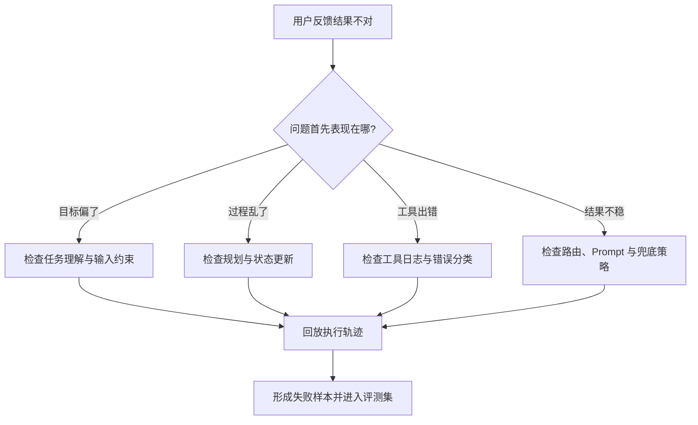

# Agent 观测与评测：如何定位问题并持续优化

## 目录

1. [这篇文档想解决什么问题](#1-这篇文档想解决什么问题)
2. [为什么 Agent 问题经常看起来像玄学](#2-为什么-agent-问题经常看起来像玄学)
3. [观测和评测分别在解决什么](#3-观测和评测分别在解决什么)
4. [生产里应该重点看哪些东西](#4-生产里应该重点看哪些东西)
5. [一个排障分析图](#5-一个排障分析图)
6. [如何建立基础评测集](#6-如何建立基础评测集)
7. [常见排障路径](#7-常见排障路径)
8. [常见误区](#8-常见误区)
9. [练习题与思考方向](#9-练习题与思考方向)
10. [总结与下一步建议](#10-总结与下一步建议)

## 适用人群

这篇文档适合已经意识到 Agent 会不稳定，但还不清楚线上应该看哪些日志、指标和样本来定位问题的人。

## 学习目标

学完后，你应该能够：

1. 区分观测和评测的作用
2. 理解 Agent 排障为什么必须看过程而不是只看结果
3. 建立一个基础的持续优化框架

---

## 1. 这篇文档想解决什么问题

很多团队在做 Agent 时，会遇到一种很挫败的状态：

- 用户说结果不对
- 团队也知道不对
- 但不知道到底是哪一层不对

之所以会这样，是因为 Agent 的问题通常横跨多层：

- 任务理解
- 规划
- 工具调用
- 状态更新
- 输出整合

如果没有观测和评测，你看到的只是“坏结果”，看不到“坏过程”。

---

## 2. 为什么 Agent 问题经常看起来像玄学

因为很多系统只保留了最终回答，没有保留：

- 中间计划
- 工具选择
- 参数
- 返回结果
- 状态变化

于是最后只能凭感觉猜：

- 是模型理解错了？
- 还是工具没调对？
- 还是状态丢了？
- 还是压根不该用 Agent？

---

## 3. 观测和评测分别在解决什么

### 3.1 观测

观测更偏线上，它回答的是：

- 这次执行具体发生了什么
- 哪一步耗时最长
- 哪一步最容易失败
- 失败时的上下文是什么

### 3.2 评测

评测更偏离线和持续优化，它回答的是：

- 这套系统在一组代表性任务上表现怎样
- 改了策略后，是变好了还是变差了
- 哪类任务仍然是系统弱项

一句话理解：

- 观测回答“这次为什么错”
- 评测回答“整体上哪里弱”

---

## 4. 生产里应该重点看哪些东西

建议至少补下面几类信息：

### 4.1 执行轨迹

包括：

- 任务目标
- 规划步骤
- 每一步选择了什么动作
- 为什么选这个动作

### 4.2 工具调用日志

包括：

- 调了哪个工具
- 参数是什么
- 是否成功
- 返回了什么
- 耗时多长

### 4.3 状态快照

重点看：

- 当前任务状态
- 已完成步骤
- 中间结果
- 是否发生状态覆盖或漂移

### 4.4 关键指标

例如：

- 任务完成率
- 平均步骤数
- 工具失败率
- 回退率
- 人工接管率
- 平均时延
- 平均成本

---

## 5. 一个排障分析图

这张图最重要的意思是：

线上问题最好不要只修一次，而要沉淀成后续评测样本。

---

## 6. 如何建立基础评测集

Agent 的评测集不一定一开始就很大，但要尽量覆盖真实场景。

建议先收集下面几类样本：

- 常规顺利样本
- 边界复杂样本
- 工具容易失败的样本
- 多轮上下文依赖样本
- 历史真实事故样本

评测时不要只看“最后答得像不像”，还要看：

- 是否调用了正确工具
- 是否走了合理路径
- 是否在可接受步数内完成

---

## 7. 常见排障路径

一个实用的排障顺序通常是：

1. 先看用户目标和输入是否明确
2. 再看系统选了哪条链路
3. 再看中间规划是否偏
4. 再看工具调用是否成功
5. 再看状态是否更新正确
6. 最后看输出整合是否失真

这个顺序的好处是：

可以避免一上来就把问题全部怪到模型身上。

---

## 8. 常见误区

### 8.1 误区一：只看最终正确率

对于 Agent 来说，中间过程同样重要。

### 8.2 误区二：线上问题修完就结束

如果不把线上事故沉淀成评测样本，系统会反复踩同样的坑。

### 8.3 误区三：日志越多越好

关键不是堆所有日志，而是保留能支持定位的关键轨迹和状态。

### 8.4 误区四：没有工具失败样本也能评测稳定性

很多稳定性问题正是要通过失败样本暴露出来。

---

## 9. 练习题与思考方向

### 练习 1

为什么 Agent 排障必须保留中间轨迹，而不能只保留最终答案？

参考方向：

- 错误发生在过程里
- 最终答案看不到决策链

### 练习 2

为什么线上问题最好沉淀成离线评测样本？

思考方向：

- 防止同类问题反复出现
- 建立持续优化闭环

### 练习 3

如果一个 Agent 系统成本很高，你会从哪些观测指标开始排查？

参考方向：

- 平均步骤数
- 工具调用次数
- 无效循环率
- 失败重试率

---

## 10. 总结与下一步建议

生产级 Agent 想持续优化，关键不只是“改 Prompt”或“换模型”，而是：

**把每一次失败都变成可回放、可分析、可再评测的问题。**

如果你把观测和评测补齐，Agent 系统就会从“看运气”逐渐走向“可定位、可优化、可迭代”。
