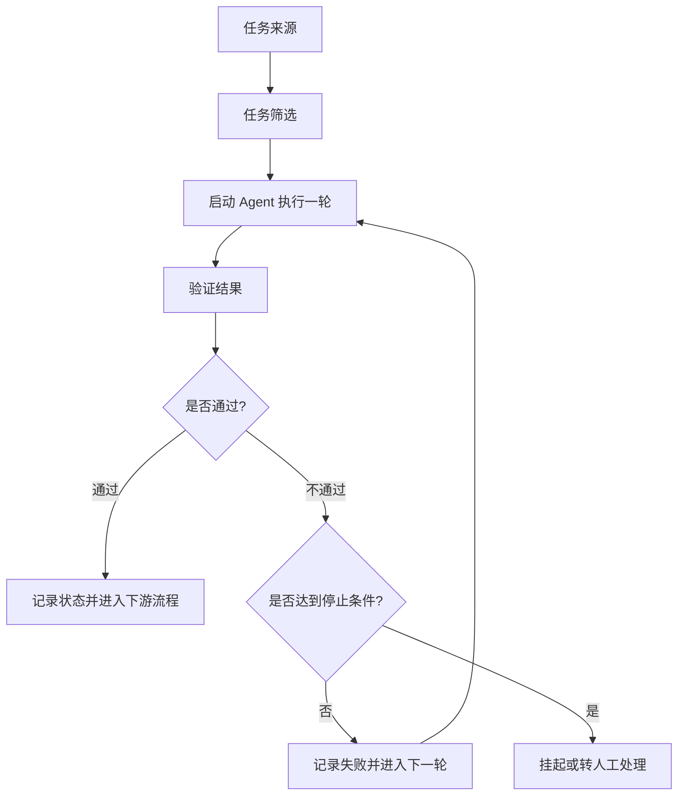

# 12. Loop Engineering：让 Agent 任务持续流动的工程闭环

## 目录

1. [适用人群](#1-适用人群)
2. [学习目标](#2-学习目标)
3. [什么是 Loop Engineering](#3-什么是-loop-engineering)
4. [它解决什么问题](#4-它解决什么问题)
5. [核心概念和流程](#5-核心概念和流程)
6. [常见误区或失败原因](#6-常见误区或失败原因)
7. [练习题或实战建议](#7-练习题或实战建议)
8. [总结与下一步建议](#8-总结与下一步建议)

## 1. 适用人群

这篇文档适合以下读者：

- 已经理解 Agent、工具调用、Harness Engineering，想进一步理解“如何让 Agent 持续工作”的人
- 已经能用 Coding Agent 修一次问题，但还没有把它接入日常研发流程的人
- 想把 Agent 从“单次助手”升级成“持续处理任务的工程系统”的工程师

## 2. 学习目标

读完后，你应该能够：

1. 用自己的话解释 `Loop Engineering` 的核心含义
2. 分清 `Harness Engineering` 和 `Loop Engineering` 各自解决什么问题
3. 判断一类任务是否适合被放进持续循环
4. 理解为什么长期状态必须放在模型外部
5. 设计一个最小可用的 Agent Loop

## 3. 什么是 Loop Engineering

如果说 `Harness Engineering` 关注的是“Agent 拿到任务后怎么稳定执行”，那么 `Loop Engineering` 关注的就是：

**当一次任务做完以后，系统怎么决定下一步，并让任务持续、稳定、可控地向前推进。**

它解决的已经不是“Agent 会不会写代码、会不会调工具”这种单次执行问题，而是：

- 任务从哪里来
- 谁来触发下一轮
- 结果怎么验证
- 失败后怎么处理
- 什么情况下应该停下来

可以用一句话理解：

**Harness 让 Agent 把一件事做完，Loop 让 Agent 持续拿到下一件该做的事，并且知道什么时候该停。**

所以，Loop Engineering 不是再写一个更强的 Prompt，也不是简单把 Agent 放进定时任务里。它更像是 Agent 时代的流程工程：

- 人负责定义任务来源、边界、验收标准和退出条件
- Agent 负责在每一轮里执行具体动作
- 外部系统负责记录状态、反馈结果并决定是否进入下一轮

## 4. 它解决什么问题

很多团队已经有能力让 Coding Agent 完成一次相对完整的工程任务，例如：

- 读取仓库
- 定位问题
- 修改文件
- 运行测试
- 输出 diff 或 PR

但如果每天都要重复做类似事情，新的瓶颈就出现了。问题不再是“这一次能不能做成”，而是“为什么每次都还要人来点火”。

Loop Engineering 主要解决下面 4 类问题。

### 4.1 解决重复派活的人工摩擦

如果每次都要人工去发现任务、整理上下文、启动 Agent、检查结果，再决定下一步，那么随着使用频率上升，人会越来越像一个调度器。

Loop Engineering 试图把这些重复动作做成循环，让系统自己完成：

1. 发现任务
2. 创建执行上下文
3. 启动 Agent
4. 验证结果
5. 记录状态
6. 进入下一轮或退出

### 4.2 解决“只会修一次，不会治理一类问题”

只靠单次 Agent 执行，往往只能处理一次具体事件。  
例如：这次 `CI` 失败了，你把日志贴给 Agent，让它修一次。

但真正更有价值的是把它升级成流程：

- 定时扫描 CI 失败
- 过滤掉已知环境抖动
- 将可处理问题写入任务池
- 为每个任务启动独立执行环境
- 测试通过则生成 PR
- 多次失败则停止并交给人

这时你治理的已经不是“一次 CI 失败”，而是一类持续发生的问题。

### 4.3 解决长期任务中的状态丢失和上下文污染

长期运行 Agent 很容易碰到两个问题：

- 对话越积越长，失败尝试、临时判断、旧上下文一起堆积，后面越来越偏
- 进度只存在对话里，一旦窗口压缩、中断或切换任务，下一轮接不上

Loop Engineering 的一个关键原则是：

**模型负责当前轮次的判断，外部系统负责保存长期状态。**

也就是说，任务进度、重试次数、失败原因、产出记录，不应该只留在聊天上下文中。

### 4.4 解决“自动化看起来在跑，其实没有收敛”

很多循环系统失败，不是因为 Agent 完全做不了，而是因为任务本身没有明确收敛条件。

例如“持续优化登录模块”就很容易失控，因为它几乎可以无限重构、改命名、补测试，看起来每轮都有产出，但很难判断是否真正接近目标。

相比之下，更适合进入 Loop 的任务通常具备：

- 范围清晰
- 完成条件可检查
- 失败原因可归因
- 达到上限后有明确出口

## 5. 核心概念和流程

### 5.1 Harness 解决执行，Loop 解决流转

这是理解 Loop Engineering 最重要的边界。

`Harness Engineering` 主要关心：

- 上下文怎么组织
- 工具怎么暴露
- 命令怎么执行
- 权限怎么控制
- 日志怎么记录
- 失败后怎么恢复

`Loop Engineering` 主要关心：

- 一次执行结束后接下来怎么办
- 通过了是否创建 PR 或进入下游流程
- 失败了是否重试、回滚、挂起或交给人
- 任务池里还有没有下一项
- 哪些状态要带到下一轮，哪些上下文要丢弃

可以类比成：

- `Harness` 像一台可靠的加工设备
- `Loop` 像一条持续运转的小型生产线

前者决定单件任务能不能完成，后者决定任务能不能持续流动。

### 5.2 一个最小 Loop 的基本结构

一个最小可用的 Agent Loop，通常至少包括下面 6 个部分：

1. `任务来源`
   例如 CI 失败、Issue 队列、告警事件、待迁移清单、定时巡检结果
2. `任务筛选`
   过滤明显不该自动处理的问题，例如环境抖动、重复事件、黑名单任务
3. `单轮执行`
   为任务准备上下文，启动 Agent，完成一次修改、验证或分析
4. `结果验证`
   通过测试、规则检查、结构校验或人工审核判断结果是否可接受
5. `状态落盘`
   记录结果、重试次数、失败原因、变更链接、摘要等外部状态
6. `退出或继续`
   成功则进入下游，失败则重试、挂起或交给人，未完成则进入下一轮

可以把它画成这样：

### 5.3 任务是否适合进入 Loop，要先看收敛条件

Loop 设计最难的地方，不是接多少工具，而是判断任务能不能收敛。

一个适合进入循环的任务，通常要能回答下面 4 个问题：

1. 任务范围是否清楚
2. 完成条件是否可验证
3. 失败原因是否可归因
4. 停止条件是否明确

例如下面这个任务，相对适合：

> 将旧认证 SDK 的调用迁移到新 SDK；`auth` 目录下测试必须通过；公共 API 入参与返回结构保持兼容；连续三轮无法通过测试则停止，并输出阻塞原因。

它适合进入 Loop，是因为它具备：

- 明确范围：`auth` 目录
- 明确检查：测试通过、接口兼容
- 明确停止条件：连续三轮失败即退出
- 明确失败出口：输出阻塞原因并转人工

### 5.4 状态必须放在模型外面

这是长期 Agent 系统非常关键的一条原则。

如果状态只存在模型上下文里，会产生几个问题：

- 任务历史会不断污染下一轮决策
- 模型压缩上下文后，关键进度可能丢失
- 进程中断或窗口关闭后，任务无法可靠恢复

更稳的做法是把状态拆开：

- 模型上下文：只保留当前轮次真正需要的输入
- 外部状态：保存任务状态、重试次数、执行日志、阻塞原因
- Git 或工件系统：保存代码变更、PR、产物摘要

这意味着下一轮最好尽量用干净上下文重新启动，而不是把旧对话无限续上去。

### 5.5 一个典型例子：从修一次 CI 到治理一类 CI

这是理解 Loop Engineering 最直观的案例。

如果只是单次 Agent 执行，流程通常是：

1. 人复制 CI 失败日志
2. 交给 Agent 分析和修复
3. Agent 修改代码并运行测试
4. 人再决定是否提交

这已经是一个相对完整的 Harness 流程，但它只解决“这一次 CI 怎么修”。

如果改造成 Loop，流程会变成：

1. 系统定时扫描 CI 结果
2. 过滤掉已知环境波动
3. 将真实故障写入任务队列
4. 每个任务进入独立 `worktree`
5. Agent 尝试修复并运行对应测试
6. 通过则生成 PR 与摘要
7. 失败则记录原因并决定是否重试
8. 超出上限则停止并转人工
9. 下一轮只继续处理新增任务和未完成任务

这时人的角色就从“每天去面板找活”，变成“只接收已经被 Loop 处理后的有效结果”。

### 5.6 Loop 的关键不是工具堆砌，而是边界设计

很多介绍会一口气把 `Automations`、`Skills`、`Worktrees`、`Sub-agents`、`MCP` 都列出来，但这些只是材料，不是 Loop 本身。

真正决定 Loop 是否成立的，是这些工程边界：

- 任务从哪里进入
- 哪些任务不应该进入
- 每轮允许做什么
- 怎么判断过关
- 连续失败时怎么退出
- 人在什么环节介入

没有这些边界，再多工具也只是让一次性 Agent 调用变得更复杂。

### 5.7 Loop 模式下，人的定位不是消失，而是上移

在 Loop 模式下，人并不是退出流程，而是从“反复亲手执行每一步”转成“定义规则并把关关键节点”。

更准确地说，人的核心职责通常包括 4 类：

1. `定义目标`
   决定这条 Loop 到底要解决什么问题，处理哪一类任务，不处理哪一类任务
2. `定义约束`
   规定范围、权限、可用工具、风险边界、重试上限、人工接管条件
3. `定义验收`
   明确什么叫完成，什么叫失败，哪些检查必须通过，哪些结果必须保留给人审阅
4. `做最终合并判断`
   Agent 可以生成 diff、提交变更、创建 PR，但是否真的合并进主干，通常仍应由人做最终判断

这也是 Loop 和“完全放手自动化”的关键区别：

**Agent 负责持续执行，系统负责持续流转，人负责定义目标、约束、验收，并在高风险结果上保留最终决策权。**

如果再概括一点，人在 Loop 里主要做的是：

- 选什么任务值得进入 Loop
- 这类任务允许 Agent 做到哪一步
- 怎样判断这轮结果是否合格
- 什么情况下必须停下来交还给人
- 最终是否批准进入正式代码库或正式业务流程

所以，Loop Engineering 并不是让人“不再参与”，而是让人的参与从低价值重复劳动，转向高价值的规则设计、风险控制和最终裁决。

### 5.8 一个最小可落地的实践清单

如果你准备在项目里尝试一个 Loop，可以先从下面这套最小清单开始：

1. 选一类重复出现的任务
2. 给任务写出明确范围和完成标准
3. 设计自动验证方式，例如测试、规则检查或结构校验
4. 定义重试上限和人工接管条件
5. 把任务状态写入外部文件、数据库或任务系统
6. 每轮尽量用干净上下文启动 Agent
7. 为结果沉淀摘要、日志和阻塞原因

这套清单的重点不是“全自动”，而是先保证可控、可停、可查。

## 6. 常见误区或失败原因

### 6.1 误以为 Loop Engineering 就是给 Agent 加定时器

定时运行只是触发方式，不等于 Loop。

真正的 Loop 至少还需要：

- 明确的任务来源
- 验证机制
- 状态存储
- 停止条件
- 人工兜底出口

### 6.2 误以为所有任务都适合进入循环

模糊、开放、无法自动验证的任务，通常不适合直接进入 Loop。

例如：

- “持续优化体验”
- “把这块代码整理得更优雅”
- “有空就继续重构一下”

这类任务容易让 Agent 持续产出，却不一定持续接近目标。

### 6.3 误以为 Agent 自己会记住长期状态

聊天记录不是可靠的任务系统。

如果进度、失败原因、重试次数都只写在对话里，那么一旦中断或压缩上下文，系统就会失去连续性。

### 6.4 误以为验证通过一次就代表循环成立

单轮通过只能说明“这次成功了”，不能说明“这个流程能长期稳定运行”。

判断一个 Loop 是否站得住，至少还要看：

- 新任务能否持续进入
- 重复失败会不会无限消耗成本
- 异常任务是否能及时退出
- 人是否只在高价值节点介入

### 6.5 误以为 Loop 会替代人工判断

Loop 的意义不是把人拿掉，而是把人从低价值重复劳动里移开。

真正该保留给人的，通常包括：

- 规则制定
- 边界调整
- 高风险审批
- 阻塞问题决策
- 失败模式复盘

## 7. 练习题或实战建议

### 7.1 练习题

1. 为什么说 `Loop Engineering` 解决的是“任务流转问题”，而不是“单次执行问题”？
2. 为什么模糊任务通常不适合直接进入 Loop？
3. 如果一个 Agent 系统每次都从聊天记录里恢复进度，而没有外部状态存储，长期来看最容易出什么问题？

### 7.2 思考方向

可以从下面几个方向思考：

- Loop 关注的是“下一轮怎么办”，因此它天然跨越多次 Agent 执行
- 模糊任务缺乏明确边界、检查条件和停止条件，容易变成无休止迭代
- 没有外部状态时，系统会在上下文污染、中断恢复和进度连续性上变得很脆弱

### 7.3 一个建议立刻动手的小练习

你可以从自己的项目里选一类重复任务，尝试写出下面 5 项内容：

1. 任务来源是什么
2. 哪些情况应当过滤掉
3. 完成标准是什么
4. 最多允许失败几次
5. 失败后交给谁、以什么形式交接

如果这 5 项写不清楚，通常说明这类任务还不适合进入真正的 Loop。

## 8. 总结与下一步建议

一句话总结：

**Loop Engineering 不是让 Agent 更会做事，而是让一类可验证、可收敛的任务，在明确边界内持续流动。**

如果你已经读完本篇，建议下一步继续阅读：

- [11.Harness Engineering：在Agent时代如何驾驭智能体.md](/Users/chenmingdong01/Documents/AI/agent/05-Agent/11.Harness%20Engineering：在Agent时代如何驾驭智能体.md)
- [6.Agent观测与评测：如何定位问题并持续优化.md](/Users/chenmingdong01/Documents/AI/agent/05-Agent/6.Agent观测与评测：如何定位问题并持续优化.md)
- [10.评测Pipeline实战.md](/Users/chenmingdong01/Documents/AI/agent/07-项目实战/10.评测Pipeline实战.md)

## 参考来源

- 腾讯云开发者社区：[Agent 系列（六）：什么是 Loop Engineering？](https://cloud.tencent.com/developer/article/2686804)
