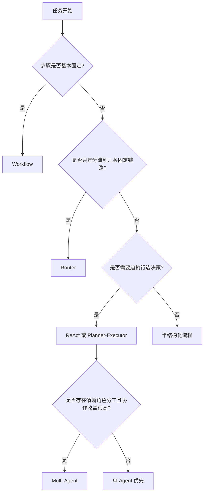

# 3. Agent 系统怎么选型：Workflow、Router、ReAct 与 Multi-Agent

## 目录

1. [这篇文档要解决什么问题](#1-这篇文档要解决什么问题)
2. [为什么选型比堆能力更重要](#2-为什么选型比堆能力更重要)
3. [先判断到底需不需要 Agent](#3-先判断到底需不需要-agent)
4. [几种常见架构分别适合什么场景](#4-几种常见架构分别适合什么场景)
5. [一个帮助理解的选型图](#5-一个帮助理解的选型图)
6. [企业里常见的选型错误](#6-企业里常见的选型错误)
7. [一个实用的选型流程](#7-一个实用的选型流程)
8. [练习题与思考方向](#8-练习题与思考方向)
9. [总结与下一步建议](#9-总结与下一步建议)

## 适用人群

这篇文档适合知道几种 Agent 架构名字，但还不会根据业务任务做架构判断的学习者。

## 学习目标

学完后，你应该能够：

1. 区分 Workflow、Router、ReAct、Planner-Executor、Multi-Agent 的主要差异
2. 根据任务稳定性、复杂度和风险做初步选型
3. 避免为了“显得高级”而过度设计

---

## 1. 这篇文档要解决什么问题

很多团队做 Agent 时，第一个错误不是代码写错，而是架构选错。

比如：

- 本来固定流程就能解决，却做成完全自由 Agent
- 本来一个单 Agent 足够，却拆成多个角色相互对话
- 本来需要路由和兜底，却只堆 Prompt

所以选型的核心不是“哪种最先进”，而是：

**哪种结构最适合当前任务，并且在成本、稳定性和可控性之间平衡最好。**

---

## 2. 为什么选型比堆能力更重要

因为架构决定了三件非常关键的事：

- 决策空间有多大
- 系统是否容易失控
- 问题发生后是否容易定位

很多 Agent 项目不是败在能力不足，而是败在：

- 自由度给太大
- 失败路径没设计
- 协作关系太复杂

---

## 3. 先判断到底需不需要 Agent

先问自己下面几个问题：

### 3.1 路径是否基本固定

如果任务步骤基本明确，通常优先用 Workflow。

### 3.2 是否需要动态决策

如果系统要根据中间结果决定下一步，Agent 价值就会上升。

### 3.3 是否需要多工具协同

如果任务涉及检索、数据库、执行器、审批链等多种工具，Router 或 Agent 更可能有价值。

### 3.4 失败成本高不高

如果失败成本很高，通常要先压缩自由度，而不是追求“全自动”。

---

## 4. 几种常见架构分别适合什么场景

### 4.1 Workflow

适合：

- 步骤稳定
- 输入变化有限
- 对可控性要求高

优点是稳，缺点是灵活性有限。

### 4.2 Router

适合：

- 任务类型多
- 需要在几条固定链路中选择
- 希望比纯 Workflow 更灵活，但又不想完全放开

### 4.3 ReAct

适合：

- 需要边观察边决策
- 任务路径不完全确定
- 工具调用较多

它灵活，但更容易出现轨迹过长和局部失控。

### 4.4 Planner-Executor

适合：

- 任务中等复杂
- 需要先拆解再执行
- 希望减少随意试错

### 4.5 Multi-Agent

适合：

- 职责真的可以明显分工
- 子任务边界清晰
- 协作收益明显高于协调成本

它不是默认高级方案，反而通常是后期才考虑的方案。

---

## 5. 一个帮助理解的选型图

这张图想表达的不是绝对规则，而是一个很实用的顺序：

**先从简单、可控的方案开始，再在必要时增加自由度。**

---

## 6. 企业里常见的选型错误

### 6.1 把所有复杂任务都交给自由 Agent

结果通常是：

- 成本高
- 路径不稳定
- 排障困难

### 6.2 过早上 Multi-Agent

多 Agent 往往带来：

- 协议复杂
- 状态同步复杂
- 延迟更高
- 错误链更长

### 6.3 明明适合 Router，却硬做复杂规划

很多业务其实只是“判一下问题属于哪类，再走对应链路”，并不需要完整 Agent 循环。

### 6.4 忽略失败成本

如果是高风险任务，应该优先选择更可控、可审计、可兜底的架构。

---

## 7. 一个实用的选型流程

可以先按下面顺序判断：

1. 先列出任务目标、输入类型、输出要求和失败成本
2. 判断路径是否固定，若固定优先 Workflow
3. 如果只是链路分流，优先 Router
4. 如果需要多步动态决策，再考虑 ReAct 或 Planner-Executor
5. 只有在职责边界非常清晰时，再考虑 Multi-Agent
6. 无论选哪种结构，都先补失败处理和人工兜底

---

## 8. 练习题与思考方向

### 练习 1

为什么说“先判断需不需要 Agent”，比“先找一个 Agent 框架”更重要？

参考方向：

- 架构复杂度本身就是成本
- 不必要的自由度会带来不稳定

### 练习 2

在什么情况下，Router 会比自由 Agent 更合适？

思考方向：

- 问题类型可分类
- 每类都有相对稳定的处理链路

### 练习 3

为什么 Multi-Agent 不应该被当成默认升级路线？

参考方向：

- 协调成本和调试成本都更高

---

## 9. 总结与下一步建议

Agent 选型最重要的原则，不是“做得最像智能体”，而是：

**用刚刚好的自由度，解决刚刚好的问题。**

下一步建议继续阅读：

- [Agent稳定性设计：工具调用、状态管理、重试与人工兜底.md](/Users/chenmingdong01/Documents/AI/agent/05-Agent/4.Agent稳定性设计：工具调用、状态管理、重试与人工兜底.md)
- [Agent观测与评测：如何定位问题并持续优化.md](/Users/chenmingdong01/Documents/AI/agent/05-Agent/5.Agent观测与评测：如何定位问题并持续优化.md)

这样你会把“怎么选”进一步连到“怎么让它稳定”和“怎么持续优化”。
