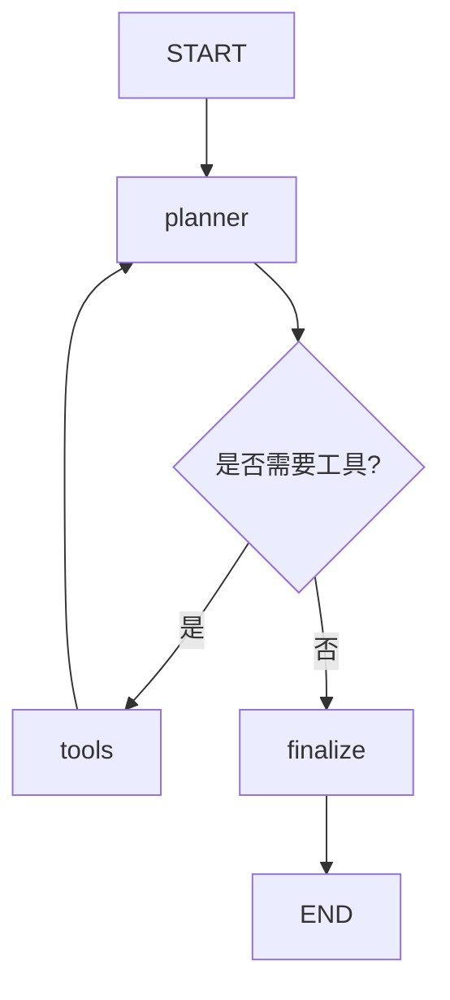

# 9. LangGraph 入门：作用、优势、常用 API 与应用场景

## 适用人群

这篇文档适合已经学过 Agent 基础概念、工具调用、RAG，准备进入“可控编排”和“工程落地”阶段的学习者。

## 学习目标

读完后你应该能够：

1. 解释 LangGraph 是什么，以及它在 Agent 系统里的定位
2. 说清 LangGraph 主要解决的问题和相对优势
3. 掌握常用 API 的作用、核心参数和使用方式
4. 判断哪些场景适合用 LangGraph，哪些场景不必上 LangGraph
5. 能设计一个最小可运行的 LangGraph Agent 流程

## 目录

1. [什么是 LangGraph](#1-什么是-langgraph)
2. [它解决什么问题](#2-它解决什么问题)
3. [核心概念和流程](#3-核心概念和流程)
4. [LangGraph 的作用与优势](#4-langgraph-的作用与优势)
5. [常用 API：功能与参数说明（Python）](#5-常用-api功能与参数说明python)
6. [典型应用场景](#6-典型应用场景)
7. [常见误区或失败原因](#7-常见误区或失败原因)
8. [实战建议与练习题](#8-实战建议与练习题)
9. [参考答案与思考方向](#9-参考答案与思考方向)
10. [总结与下一步建议](#10-总结与下一步建议)

## 1. 什么是 LangGraph

LangGraph 是一个面向 Agent 编排的底层框架。它把 Agent 的执行过程抽象成“图”：

1. `State`：共享状态（任务上下文）
2. `Node`：执行逻辑（模型调用、工具调用、数据处理）
3. `Edge`：调度规则（下一步去哪里）

可以把它理解为：

- LangChain 更偏“组件和高层封装”
- LangGraph 更偏“执行编排和可控运行时”

一句话：LangGraph 不是让 Agent“看起来更聪明”，而是让 Agent“更可控、更可观测、更可恢复”。

## 2. 它解决什么问题

当你从 Demo 走向真实业务时，通常会遇到这些问题：

1. 流程复杂后，`if/else` 爆炸，逻辑难维护
2. 工具调用出错后，不知道如何重试、回滚或中断
3. 多轮任务中状态丢失，或者状态污染
4. 无法在执行中插入人工审核（Human-in-the-loop）
5. 出问题后难以定位“错在节点、路由、工具还是状态”

LangGraph 通过“显式状态 + 图调度 + 可持久化执行 + 流式可观测”来解决这些问题。

## 3. 核心概念和流程

### 3.1 最小闭环

一个最小 LangGraph 流程通常是：

1. 定义状态 Schema
2. 编写节点函数
3. 连接边（普通边或条件边）
4. `compile()` 编译成可执行图
5. `invoke()` 或 `stream()` 执行

### 3.2 典型执行图

### 3.3 Graph API 与 Functional API

LangGraph 提供两种常见开发方式：

1. Graph API：显式定义节点与边，适合复杂路由、需要强可视化和精细控制的系统
2. Functional API：通过 `@entrypoint` / `@task` 编排，适合更函数式、更轻量的工作流

## 4. LangGraph 的作用与优势

### 4.1 作用

1. 将多步 Agent 任务结构化为可维护的执行图
2. 把“状态管理、分支决策、重试、流式输出、中断恢复”纳入统一运行时
3. 支持从单 Agent 逐步升级到子图、多 Agent、生产部署

### 4.2 优势

1. 可控性强：节点和路由显式定义，行为边界清楚
2. 可恢复性强：结合 checkpointer 支持暂停、恢复、回放
3. 可观测性好：支持多种 `stream_mode`，便于调试轨迹
4. 工程化友好：重试、缓存、中断、人审机制可以标准化
5. 演进成本低：先做最小图，再逐步加节点、分支、子图

## 5. 常用 API：功能与参数说明（Python）

下面列的是最常用、最值得优先掌握的一组 API。

### 5.1 `StateGraph(...)`

功能：定义图及其状态模型。

常见参数：

1. `state_schema`：必填，图状态类型（如 `TypedDict` / Pydantic）
2. `context_schema`：可选，运行时上下文（如 `user_id`、数据库连接配置）
3. `input_schema`：可选，定义图输入 Schema
4. `output_schema`：可选，定义图输出 Schema

### 5.2 `builder.add_node(...)`

功能：向图中注册一个节点。

常见参数：

1. `node`：节点名或节点函数
2. `action`：当 `node` 是字符串时，对应的函数/可运行对象
3. `defer=False`：是否延迟到接近结束时执行
4. `retry_policy=None`：节点重试策略
5. `cache_policy=None`：节点缓存策略
6. `input_schema=None`：节点输入 Schema（默认继承图状态）
7. `destinations=None`：声明可跳转目标（常用于返回 `Command` 的节点）

### 5.3 `builder.add_edge(start, end)`

功能：添加固定流转边。

常见参数：

1. `start_key`：起点节点名，支持单个字符串或列表
2. `end_key`：终点节点名

说明：当 `start_key` 传多个节点时，会等待这些起点全部完成后再进入终点。

### 5.4 `builder.add_conditional_edges(source, path, path_map=None)`

功能：添加条件路由边。

常见参数：

1. `source`：源节点
2. `path`：路由函数，返回下一个节点（或多个节点）
3. `path_map=None`：可选映射，把路由返回值映射到具体节点名

说明：路由函数返回 `END`（或等价终止标识）时，可结束流程。

### 5.5 `builder.compile(...)`

功能：把构建器编译为可执行图。

常见参数：

1. `checkpointer=None`：短期记忆/断点恢复核心配置
2. `cache=None`：图级缓存
3. `store=None`：持久化存储（常用于长期记忆）
4. `interrupt_before=None`：在指定节点执行前中断
5. `interrupt_after=None`：在指定节点执行后中断
6. `debug=False`：是否开启调试
7. `name=None`：图名称

实践要点：启用 checkpointer 后，调用时通常要传 `thread_id` 用于会话隔离。

### 5.6 `graph.invoke(input, config=None, ...)`

功能：单次执行图并返回最终结果。

常见参数：

1. `input`：输入状态或 `Command`
2. `config`：运行配置（如 `configurable.thread_id`）
3. `context`：本次运行的静态上下文
4. `stream_mode='values'`：流模式（即使 `invoke` 也可设）
5. `interrupt_before / interrupt_after`：运行时中断控制
6. `durability`：持久化策略（如 `sync` / `async` / `exit`）

### 5.7 `graph.stream(input, config=None, ...)`

功能：按步骤流式产出执行过程。

常见参数：

1. `stream_mode`：常见有 `values`、`updates`、`messages`、`debug` 等
2. `subgraphs=False`：是否输出子图内部事件
3. `output_keys=None`：仅输出指定键
4. `interrupt_before / interrupt_after`：流式中断控制
5. `durability`：持久化策略

适用场景：前端实时显示执行轨迹、线上排障、评测采样。

### 5.8 `Command` / `Send` / `interrupt`

1. `Command`：在节点里“同时更新状态 + 控制跳转”，适合复杂控制流
2. `Send`：用于 map-reduce / fan-out 并发分发
3. `interrupt(value)`：在节点内主动中断，等待外部输入后恢复（HITL）

注意：`interrupt` 依赖 checkpointer；没有持久化状态就无法可靠恢复。

### 5.9 `ToolNode(...)`（`langgraph.prebuilt`）

功能：标准化工具调用节点（支持并行工具调用和错误处理）。

常见参数：

1. `tools`：工具列表（函数或 `BaseTool`）
2. `name='tools'`：节点名
3. `handle_tool_errors`：工具错误处理策略
4. `messages_key='messages'`：状态中的消息键名
5. `tags`：可选标签

说明：如果你要自定义工作流，`ToolNode` 很实用；如果只是标准 ReAct 闭环，可先用高层 Agent 工厂快速起步。

## 6. 典型应用场景

### 6.1 适合使用 LangGraph 的场景

1. 多步骤、强状态依赖的业务流程
2. 需要工具调用 + 条件路由 + 重试兜底
3. 需要人工审核/人工确认的关键环节
4. 需要长期运行、可中断恢复的任务
5. 需要清晰执行轨迹用于评测与审计

具体例子：

1. 企业知识问答 Agent（检索、校验、回答、引用检查）
2. 工单处理 Agent（分类、查询系统、执行动作、回写）
3. 投研/情报分析 Agent（多源检索、对比、汇总）
4. Code Agent（规划、工具执行、测试反馈循环）

### 6.2 不一定要用 LangGraph 的场景

1. 单轮问答或简单改写
2. 固定 2-3 步且不需要复杂分支的流水线
3. 对可恢复、可追踪、可审计要求很低的原型实验

## 7. 常见误区或失败原因

1. 一上来就画很大图，导致复杂度过高
2. 状态设计混乱，把长期记忆、临时变量、日志混在一起
3. 路由函数过度依赖自然语言，缺少结构化信号
4. 只关注“能跑通”，忽略重试、超时、异常分流
5. 不做观测和评测，线上问题无法定位

## 8. 实战建议与练习题

### 8.1 实战建议

1. 从最小闭环开始：`START -> agent -> END`
2. 每次只增加一个能力：先加工具，再加条件路由，再加记忆
3. 先定义状态字段，再写节点；避免“边写边补状态”
4. 默认加入失败兜底：超时、重试、降级、人工接管
5. 开发期优先使用 `stream_mode="updates"` 看轨迹

### 8.2 练习题

1. 设计一个“资料整理 Agent”图，至少包含：检索、去重、总结、人工确认
2. 给某个工具节点增加重试策略，并解释为何选择该策略
3. 实现一个 `interrupt` 人审节点：用户确认后才允许写入最终结果

## 9. 参考答案与思考方向

1. 题 1 关键不在节点多，而在状态边界清晰：
先定义 `raw_docs`、`dedup_docs`、`summary`、`approved` 再设计节点。
2. 题 2 可优先针对“可重试的瞬时错误”设置重试：
例如网络抖动、临时限流；对参数错误应快速失败而不是盲重试。
3. 题 3 要点是“可恢复执行”：
启用 checkpointer，`interrupt` 抛出后由外部输入 `Command(resume=...)` 恢复。

## 10. 总结与下一步建议

LangGraph 的核心价值是把 Agent 从“提示词技巧”推进到“可运行、可维护、可恢复的系统工程”。

下一步建议：

1. 先阅读并运行 [3.LangGraph聊天Agent实战.md](/Users/chenmingdong01/Documents/AI/agent/07-项目实战/3.LangGraph聊天Agent实战.md)
2. 再结合 [agent-chat-langgraph/README.md](/Users/chenmingdong01/Documents/AI/agent/07-项目实战/agent-chat-langgraph/README.md) 做一次工具扩展练习
3. 最后进入 [6.Agentic RAG：当Agent遇见检索.md](/Users/chenmingdong01/Documents/AI/agent/05-Agent/6.Agentic%20RAG：当Agent遇见检索.md) 把检索能力并入图流程

## 参考资料

1. LangGraph 概览（官方）：[https://docs.langchain.com/oss/python/langgraph](https://docs.langchain.com/oss/python/langgraph)
2. Graph API 概览（官方）：[https://docs.langchain.com/oss/python/langgraph/graph-api](https://docs.langchain.com/oss/python/langgraph/graph-api)
3. Graph API 使用指南（官方）：[https://docs.langchain.com/oss/python/langgraph/use-graph-api](https://docs.langchain.com/oss/python/langgraph/use-graph-api)
4. Functional API 概览（官方）：[https://docs.langchain.com/oss/python/langgraph/functional-api](https://docs.langchain.com/oss/python/langgraph/functional-api)
5. LangGraph Python Reference（官方）：[https://reference.langchain.com/python/langgraph/overview](https://reference.langchain.com/python/langgraph/overview)
6. `StateGraph`（参数与说明）：[https://reference.langchain.com/python/langgraph/graph/state/StateGraph](https://reference.langchain.com/python/langgraph/graph/state/StateGraph)
7. `add_node`（参数与说明）：[https://reference.langchain.com/python/langgraph/graph/state/StateGraph/add_node](https://reference.langchain.com/python/langgraph/graph/state/StateGraph/add_node)
8. `add_edge`（参数与说明）：[https://reference.langchain.com/python/langgraph/graph/state/StateGraph/add_edge](https://reference.langchain.com/python/langgraph/graph/state/StateGraph/add_edge)
9. `add_conditional_edges`（参数与说明）：[https://reference.langchain.com/python/langgraph/graph/state/StateGraph/add_conditional_edges](https://reference.langchain.com/python/langgraph/graph/state/StateGraph/add_conditional_edges)
10. `compile`（参数与说明）：[https://reference.langchain.com/python/langgraph/graph/state/StateGraph/compile](https://reference.langchain.com/python/langgraph/graph/state/StateGraph/compile)
11. `invoke`（参数与说明）：[https://reference.langchain.com/python/langgraph/pregel/main/Pregel/invoke](https://reference.langchain.com/python/langgraph/pregel/main/Pregel/invoke)
12. `stream`（参数与说明）：[https://reference.langchain.com/python/langgraph/pregel/main/Pregel/stream](https://reference.langchain.com/python/langgraph/pregel/main/Pregel/stream)
13. `interrupt`（参数与说明）：[https://reference.langchain.com/python/langgraph/types/interrupt](https://reference.langchain.com/python/langgraph/types/interrupt)
14. `ToolNode`（参数与说明）：[https://reference.langchain.com/python/langgraph.prebuilt/tool_node/ToolNode](https://reference.langchain.com/python/langgraph.prebuilt/tool_node/ToolNode)
15. LangGraph v1 更新说明（官方）：[https://docs.langchain.com/oss/python/releases/langgraph-v1](https://docs.langchain.com/oss/python/releases/langgraph-v1)
