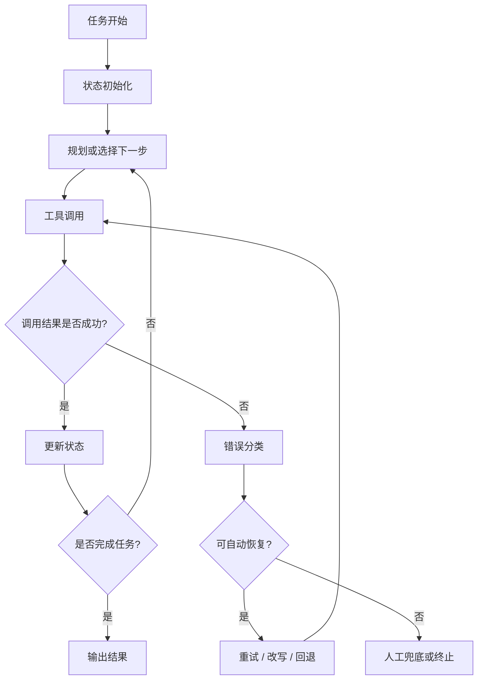

# Agent 稳定性设计：工具调用、状态管理、重试与人工兜底

## 目录

1. [这篇文档讲什么](#1-这篇文档讲什么)
2. [为什么稳定性是 Agent 上线的真正门槛](#2-为什么稳定性是-agent-上线的真正门槛)
3. [工具调用为什么是高风险点](#3-工具调用为什么是高风险点)
4. [状态管理为什么决定系统能不能持续执行](#4-状态管理为什么决定系统能不能持续执行)
5. [重试不是万能药](#5-重试不是万能药)
6. [为什么一定要有人类兜底](#6-为什么一定要有人类兜底)
7. [一个生产级稳定性闭环图](#7-一个生产级稳定性闭环图)
8. [常见稳定性误区](#8-常见稳定性误区)
9. [练习题与思考方向](#9-练习题与思考方向)
10. [总结与下一步建议](#10-总结与下一步建议)

## 适用人群

这篇文档适合已经知道 Agent 会调工具，但还不清楚为什么很多系统“能演示，却不敢上线”的学习者。

## 学习目标

学完后，你应该能够：

1. 理解 Agent 稳定性主要来自哪些工程设计
2. 说清楚工具、状态、重试、兜底之间的关系
3. 建立生产级稳定性设计的基础框架

---

## 1. 这篇文档讲什么

很多人以为 Agent 上线的关键问题是“模型够不够聪明”。但真实项目里，更常见的问题其实是：

- 工具偶发失败
- 任务执行到一半状态丢失
- 失败后只会盲目重试
- 高风险场景没有人工兜底

所以稳定性设计的核心是：

**让 Agent 在不顺利时，仍然知道怎么停、怎么退、怎么恢复。**

---

## 2. 为什么稳定性是 Agent 上线的真正门槛

因为一旦系统进入多步执行，它就不再只是“回答错一句话”的问题，而可能是：

- 做错动作
- 重复动作
- 漏掉关键步骤
- 在错误状态上继续推进

这意味着 Agent 的风险不是单点输出错误，而是过程性错误。

---

## 3. 工具调用为什么是高风险点

工具调用是 Agent 与外部世界交互的接口，所以风险特别集中。

常见风险包括：

- 参数缺失或格式不对
- 工具超时
- 权限不足
- 接口响应结构变化
- 部分成功但没有被识别

更现实的问题是：

模型看到失败信息后，不一定会正确处理它。它可能：

- 重复同样调用
- 忽略失败继续往下走
- 把错误信息当正常结果

所以生产上通常需要：

- 明确的工具 schema
- 参数校验
- 错误码分类
- 可观测的调用日志

---

## 4. 状态管理为什么决定系统能不能持续执行

多步 Agent 的本质不是“会多想几步”，而是“会在若干步之间保留正确状态”。

要重点区分的状态通常包括：

- 当前目标
- 已完成步骤
- 待完成步骤
- 中间结果
- 外部工具返回
- 可恢复检查点

如果这些状态混在一起，就容易出现：

- 重复执行
- 任务漏执行
- 旧结果污染新结果

---

## 5. 重试不是万能药

很多系统出错后默认策略是“再试一次”，但重试只对某些问题有效。

例如：

- 瞬时网络波动，适合重试
- 参数错误，不适合原样重试
- 权限错误，不适合无限重试
- 逻辑走偏，也不应该靠重试解决

所以更合理的设计通常是：

- 先判断错误类型
- 再决定重试、改写、回退还是停止

---

## 6. 为什么一定要有人类兜底

如果任务有业务风险、资金风险、权限风险或客户风险，就不能假设 Agent 永远可靠。

人工兜底常见方式包括：

- 高风险步骤需要人工审批
- 置信度低时转人工
- 连续失败达到阈值后停止自动执行
- 输出前做人工确认

人工兜底不是承认系统失败，而是生产系统的一部分。

---

## 7. 一个生产级稳定性闭环图

这张图里最重要的不是“重试”，而是：

- 失败先分类
- 再决定是否恢复
- 恢复不了就兜底

---

## 8. 常见稳定性误区

### 8.1 误区一：模型更强，稳定性就自然更高

模型能力提升会有帮助，但不能替代状态管理和失败处理。

### 8.2 误区二：出错就重试

很多错误重复重试只会放大成本和风险。

### 8.3 误区三：只记录最终结果，不记录过程

没有过程状态和调用日志，排障会非常痛苦。

### 8.4 误区四：人工兜底说明系统不够智能

恰恰相反，很多成熟系统正是因为有兜底，才敢上线。

---

## 9. 练习题与思考方向

### 练习 1

为什么状态管理在多步 Agent 里比单轮问答更重要？

参考方向：

- 任务跨多步推进
- 上一步结果会影响下一步动作

### 练习 2

为什么“出错就重试”不是一个完整的工程方案？

思考方向：

- 错误类型不同
- 有些错误会被无限放大

### 练习 3

在什么场景下，你会坚持要求人工兜底？

参考方向：

- 高风险动作
- 高价值客户
- 权限敏感操作

---

## 10. 总结与下一步建议

生产级 Agent 稳定性最核心的一句话是：

**不是让系统永远不出错，而是让系统在出错时仍然可控、可恢复、可接管。**

下一步建议继续阅读：

- [Agent观测与评测：如何定位问题并持续优化.md](/Users/chenmingdong01/Documents/AI/agent/05-Agent/Agent观测与评测：如何定位问题并持续优化.md)

因为只有把观测和评测补上，稳定性设计才不会停留在原则层面。
