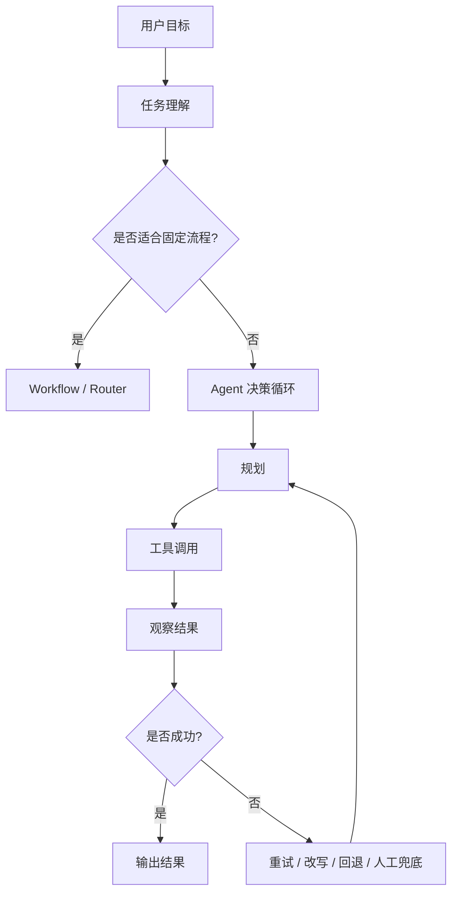

# Agent

## 适用人群

这部分内容适合已经学过 LLM、Prompt、RAG，准备进一步理解 Agent 架构、选型和生产落地问题的学习者，尤其适合：

- 已经做过简单 Agent demo，但不知道为什么一上线就不稳定的人
- 想区分 Workflow、Router、ReAct、Multi-Agent 各自适用场景的人
- 想补齐生产级 Agent 的状态管理、观测、评测和兜底设计的人

## 学习目标

学完这一部分后，你应该能够：

1. 区分聊天机器人、工作流、RAG 和 Agent 的边界
2. 理解 Agent 在真实业务中的主要难点和失败模式
3. 能根据任务类型做基础架构选型
4. 理解生产级 Agent 为什么要重视状态、工具、重试、人工兜底
5. 建立面向上线场景的观测、评测和排障意识

## 目录

1. [这一章在整个学习路线里的位置](#1-这一章在整个学习路线里的位置)
2. [建议学习顺序](#2-建议学习顺序)
3. [核心文档](#3-核心文档)
4. [生产级 Agent 的主线问题](#4-生产级-agent-的主线问题)
5. [帮助理解的整体图](#5-帮助理解的整体图)
6. [学习建议与下一步](#6-学习建议与下一步)

---

## 1. 这一章在整个学习路线里的位置

如果说：

- `02-Prompt工程` 主要解决“怎样把任务说清楚”
- `03-RAG` 主要解决“怎样把外部知识拿进来”

那么 `05-Agent` 解决的就是：

**当一个任务不能一步完成，而是需要多步决策、工具调用、状态推进和异常处理时，系统应该怎样设计。**

很多人第一次做 Agent 会有一种错觉：

“只要模型够强，再给它几个工具，它就能自己把事情做完。”

但真实系统往往卡在下面这些地方：

- 不知道该不该用 Agent
- 架构选错，复杂度远高于收益
- 工具能调，但不稳定
- 多步执行时状态容易丢
- 出错后没有兜底和回退
- 线上出了问题，很难知道到底坏在哪一层

所以 Agent 学习的重点，不只是“怎么让它看起来会做事”，更是“怎么让它在业务里可控地做事”。

---

## 2. 建议学习顺序

推荐按下面顺序学习：

1. [Agent深入学习讲义.md](/Users/chenmingdong01/Documents/AI/agent/05-Agent/Agent深入学习讲义.md)
2. [生产级Agent有哪些难点：从Demo到上线.md](/Users/chenmingdong01/Documents/AI/agent/05-Agent/生产级Agent有哪些难点：从Demo到上线.md)
3. [Agent系统怎么选型：Workflow、Router、ReAct与Multi-Agent.md](/Users/chenmingdong01/Documents/AI/agent/05-Agent/Agent系统怎么选型：Workflow、Router、ReAct与Multi-Agent.md)
4. [Agent稳定性设计：工具调用、状态管理、重试与人工兜底.md](/Users/chenmingdong01/Documents/AI/agent/05-Agent/Agent稳定性设计：工具调用、状态管理、重试与人工兜底.md)
5. [Agent观测与评测：如何定位问题并持续优化.md](/Users/chenmingdong01/Documents/AI/agent/05-Agent/Agent观测与评测：如何定位问题并持续优化.md)

这个顺序对应的逻辑是：

- 先理解 Agent 是什么
- 再理解它为什么难
- 再讨论架构怎么选
- 再补稳定性与兜底设计
- 最后补观测、评测和排障方法

---

## 3. 核心文档

### 3.1 Agent 总览

[Agent深入学习讲义.md](/Users/chenmingdong01/Documents/AI/agent/05-Agent/Agent深入学习讲义.md)

适合先建立整体认知，理解 Agent 的闭环、架构、边界和常见失败模式。

### 3.2 生产难点

[生产级Agent有哪些难点：从Demo到上线.md](/Users/chenmingdong01/Documents/AI/agent/05-Agent/生产级Agent有哪些难点：从Demo到上线.md)

这篇重点回答一个现实问题：为什么 demo 里能跑通的 Agent，一到真实业务就开始不稳定。

### 3.3 架构选型

[Agent系统怎么选型：Workflow、Router、ReAct与Multi-Agent.md](/Users/chenmingdong01/Documents/AI/agent/05-Agent/Agent系统怎么选型：Workflow、Router、ReAct与Multi-Agent.md)

这篇重点建立架构判断框架，避免一上来就堆复杂的多 Agent。

### 3.4 稳定性设计

[Agent稳定性设计：工具调用、状态管理、重试与人工兜底.md](/Users/chenmingdong01/Documents/AI/agent/05-Agent/Agent稳定性设计：工具调用、状态管理、重试与人工兜底.md)

这篇更偏工程落地，适合理解“能跑”和“可上线”之间差的是什么。

### 3.5 观测与排障

[Agent观测与评测：如何定位问题并持续优化.md](/Users/chenmingdong01/Documents/AI/agent/05-Agent/Agent观测与评测：如何定位问题并持续优化.md)

这篇重点是把线上问题从“玄学”变成“可定位的问题”。

---

## 4. 生产级 Agent 的主线问题

如果你只记住这一章的一条主线，可以记住下面 4 个问题：

### 4.1 该不该用 Agent

不是所有任务都需要 Agent。很多任务用固定 Workflow 会更稳、更便宜。

### 4.2 用哪种 Agent 架构

不同任务适合不同架构，复杂度、灵活性和稳定性之间要做平衡。

### 4.3 怎么让它稳定工作

真正的难点往往不在“模型能不能想”，而在“状态、工具、失败处理、兜底”这些工程环节。

### 4.4 怎么知道它哪里出了问题

没有日志、轨迹、指标和评测集的 Agent，通常很难持续优化。

---

## 5. 帮助理解的整体图

这张图想表达的是：

- 不是所有任务都该直接进 Agent
- 就算进入 Agent，也必须把失败路径设计出来

---

## 6. 学习建议与下一步

学习 Agent 时，建议你始终带着下面几个判断：

- 这个任务真的需要动态决策吗？
- 如果不需要，Workflow 会不会更稳？
- 如果需要 Agent，失败后怎么回退？
- 如果用户问“为什么错了”，系统能不能解释执行过程？

建议你读完这一章后，再结合 [04-工具调用与函数调用](/Users/chenmingdong01/Documents/AI/agent/04-工具调用与函数调用/README.md) 和 [07-项目实战](/Users/chenmingdong01/Documents/AI/agent/07-项目实战/agent-chat-langgraph/README.md) 一起看，把 Agent 架构和工具实现、项目落地串起来。
