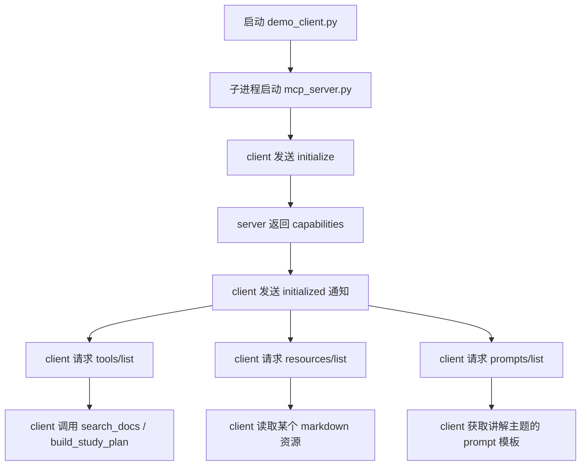

# 2. MCP 学习资料助手实战

## 目录

1. [这个项目是什么](#1-这个项目是什么)
2. [为什么这个项目适合放在项目实战](#2-为什么这个项目适合放在项目实战)
3. [适用人群](#3-适用人群)
4. [学习目标](#4-学习目标)
5. [项目解决什么问题](#5-项目解决什么问题)
6. [项目目录结构](#6-项目目录结构)
7. [核心流程](#7-核心流程)
8. [你会学到哪些 MCP 关键点](#8-你会学到哪些-mcp-关键点)
9. [如何运行](#9-如何运行)
10. [建议重点观察的地方](#10-建议重点观察的地方)
11. [常见误区](#11-常见误区)
12. [练习题](#12-练习题)
13. [总结与下一步建议](#13-总结与下一步建议)

## 1. 这个项目是什么

这是一个围绕本仓库学习资料搭建的最小 MCP 项目。

它包含两个角色：

1. `mcp_server.py`
   提供 MCP 服务端，暴露三类能力：
   - `Tools`：搜索资料、生成学习计划
   - `Resources`：读取仓库里的 Markdown 学习文档
   - `Prompts`：生成“给初学者讲解某主题”的提示模板

2. `demo_client.py`
   充当最小 MCP 客户端，演示：
   - 初始化连接
   - 列出服务端能力
   - 调用工具
   - 读取资源
   - 获取 Prompt

它不是一个大而全的生产级系统，而是一个教学型的最小闭环项目。

## 2. 为什么这个项目适合放在项目实战

如果只在概念文档里讲 MCP，学习者很容易出现两个问题：

- 觉得 MCP 只是一些接口名
- 不知道客户端和服务端到底怎么配合

所以这部分内容应该在 `07-项目实战` 里再落一个项目，原因是：

### 2.1 MCP 必须通过交互链路才能真正理解

只知道 `tools/list`、`tools/call` 这些名词没有用，必须亲眼看到：

- initialize
- list
- call
- read

整个过程怎么串起来。

### 2.2 它正好承接 05 章的理论

在 `05` 里你学的是：

- 工具是什么
- 参数怎么设计
- 结果怎么回注

在这里你看到的是：

**这些能力怎样被一个统一协议暴露给客户端。**

### 2.3 它比直接做远程 API 型项目更适合教学

这个项目不依赖外部 API Key，重点全放在协议交互本身，所以更适合入门。

## 3. 适用人群

- 已经学过函数调用基础，想进一步理解 MCP 的学习者
- 想看一个本地可运行的最小 MCP 项目的人
- 想把自己的资料库、知识库、内部工具整理成 MCP 服务的人

## 4. 学习目标

做完这个项目后，你应该能：

1. 理解一个最小 MCP 客户端如何发现服务端能力。
2. 看懂 `initialize -> initialized -> list -> call/read` 这条链路。
3. 区分什么时候该做 Tool，什么时候该做 Resource，什么时候该做 Prompt。
4. 自己继续扩展新的 Tool 或新的 Resource。
5. 把这个 Demo 改造成自己仓库里的本地 MCP 服务。

## 5. 项目解决什么问题

很多人学 MCP 时看到的都是：

- 一个天气 Tool
- 一个简单加法 Tool
- 或者 SDK 的 Hello World

这些例子能跑，但很难体现真实价值。

这个项目更贴近实际，因为它解决的是：

**如何把一个学习资料库，变成一个能被 AI 客户端标准化读取和调用的能力服务。**

项目里有三个典型场景：

1. 我想搜索和某个主题相关的课程资料
2. 我想读取某一篇具体讲义
3. 我想要一个“讲解这个主题”的教学 Prompt 模板

这三个需求分别对应：

- Tool
- Resource
- Prompt

## 6. 项目目录结构

```text
07-项目实战/mcp-study-assistant/
├── README.md
├── mcp_server.py
└── demo_client.py
```

其中：

- `README.md`：项目说明和运行方式
- `mcp_server.py`：最小 MCP 服务端实现
- `demo_client.py`：最小 MCP 客户端实现

## 7. 核心流程

整个项目的最小流程如下：



这里最关键的不是某一个函数，而是：

**客户端先发现能力，再决定怎么使用能力。**

## 8. 你会学到哪些 MCP 关键点

### 8.1 初始化不是走形式

MCP 一开始要做初始化，是因为客户端和服务端要先交换：

- 协议版本
- 支持的能力
- 实现信息

这一步决定了后面能不能正确通信。

### 8.2 Tool 不等于所有能力

项目里故意没有把 Markdown 文档也做成 Tool，而是做成 Resource。

这是为了让你建立正确直觉：

- 搜索文档：是动作，所以做 Tool
- 读取文档：是上下文，所以做 Resource

### 8.3 Prompt 不是可有可无

项目里加了 `explain_topic` Prompt 模板，就是为了说明：

MCP 不只是“工具调用协议”，它也支持把可复用的交互模板标准化暴露出来。

### 8.4 客户端和服务端是解耦的

服务端不关心你用什么 UI，不关心你用什么大模型。

客户端也不需要把服务端内部逻辑写死在自己代码里。

这正是协议层的价值。

## 9. 如何运行

### 方式一：在仓库根目录执行

当前目录应为：

```text
F:\github\agent-teacher
```

运行：

```bash
python 07-项目实战/mcp-study-assistant/demo_client.py --topic MCP --days 7
```

你也可以指定查询词：

```bash
python 07-项目实战/mcp-study-assistant/demo_client.py --query Agent --topic LangGraph --days 5
```

如果想只看客户端和服务端的交互日志，可以加：

```bash
python 07-项目实战/mcp-study-assistant/demo_client.py --query RAG --verbose
```

### 方式二：在项目目录执行

当前目录应为：

```text
F:\github\agent-teacher\07-项目实战\mcp-study-assistant
```

运行：

```bash
python demo_client.py --topic MCP --days 7
```

### 路径报错怎么判断

如果报错里出现了这种路径：

```text
...\mcp-study-assistant\07-项目实战\mcp-study-assistant\demo_client.py
```

通常说明你已经进入项目目录，但仍然用了“从仓库根目录运行”的相对路径写法。

## 10. 建议重点观察的地方

### 10.1 `initialize` 返回了什么

重点看服务端声明了哪些能力，客户端是如何基于这些能力继续往下走的。

### 10.2 `tools/list` 和 `tools/call` 的关系

先发现，再调用，这和很多“代码里直接 import 一个函数然后调用”的方式不一样。

### 10.3 `resources/read` 的返回结构

看一看服务端是怎么把 Markdown 文档包装成标准化 Resource 内容返回的。

### 10.4 Prompt 为什么也值得抽出来

Prompt 被抽成独立能力后，客户端可以按模板组织交互，而不是每次都把教学提示写死。

## 11. 常见误区

### 11.1 误区一：只要做了 Tool 就算学会 MCP

不对。真正理解 MCP，至少要同时理解：

- Tool
- Resource
- Prompt

### 11.2 误区二：MCP 项目必须接大模型才算完整

不对。第一个项目更重要的是把协议链路跑通，而不是先把 LLM 接进来。

### 11.3 误区三：服务端一定要很复杂

最小可学项目反而应该尽量简单，重点是清楚展示协议交互。

## 12. 练习题

### 练习 1

给这个项目新增一个 Tool：`list_topics`，返回仓库里所有一级主题目录。

思考方向：

- 它为什么更像 Tool，而不是 Resource
- 参数需不需要
- 输出怎样更适合客户端消费

### 练习 2

给这个项目新增一个 Prompt：`generate_quiz`，输入主题名，输出练习题模板。

思考方向：

- Prompt 的参数要有哪些
- 是否要引用某个 Resource 作为背景

### 练习 3

把 `search_docs` 从简单关键词计数，升级成更好的排序策略。

思考方向：

- 标题是否应该权重更高
- 目录层级是否应该影响排序
- 如何避免特别长的文档天然得分更高

## 13. 总结与下一步建议

这个项目的价值不在于功能多，而在于它把 MCP 最关键的三件事同时跑通了：

1. 能发现能力
2. 能调用动作
3. 能读取上下文和模板

下一步建议：

1. 先自己运行一遍这个项目。
2. 给它新增一个 Tool 或一个 Prompt。
3. 再尝试把它改造成真正服务你自己资料库的本地 MCP 服务。
