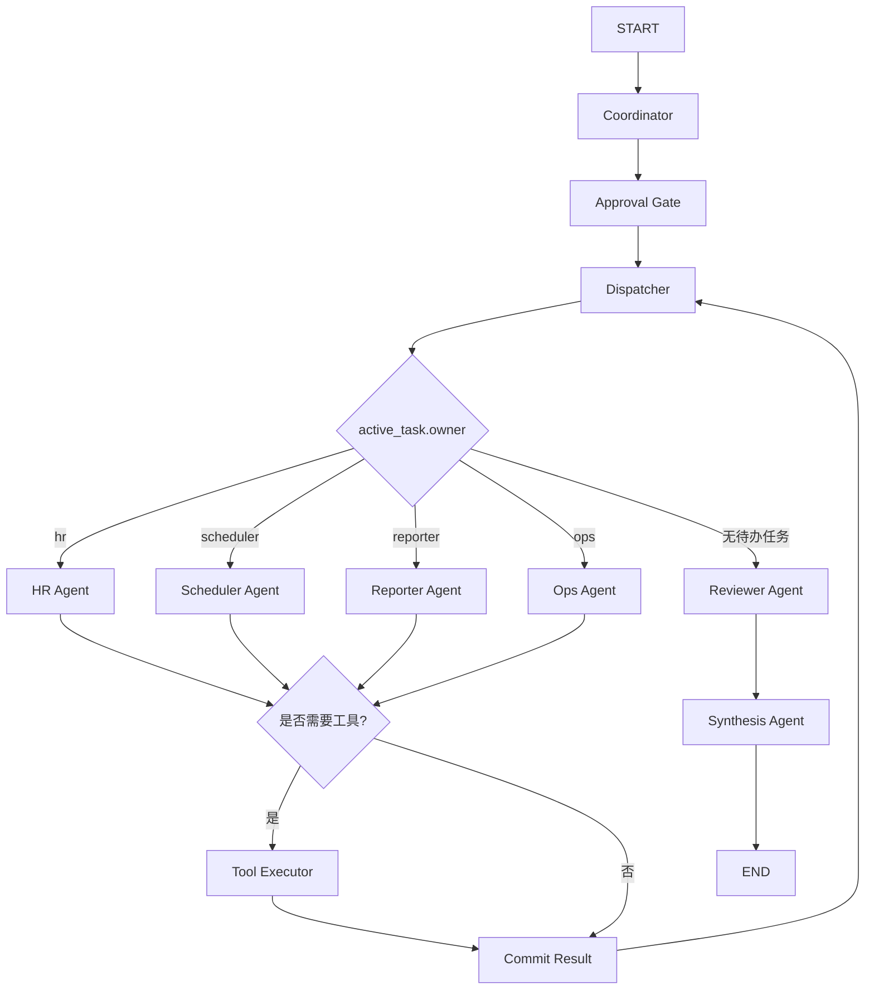

# 6. Multi-Agent 数字员工实战

## 适用人群

这份实战适合已经学过 Agent、LangGraph、工具调用基础，并希望继续理解多 Agent 协作的人。

## 学习目标

完成这个项目后，你应该能够：

1. 理解为什么数字员工场景很适合做 Multi-Agent
2. 理解 LangGraph 中多 Agent 的节点、共享状态和条件路由
3. 看懂一个“协调者 + 专家 Agent + 审核 Agent”的最小实现
4. 知道多 Agent 的核心难点在哪里，以及为什么很多难点不能只靠多写几个 Prompt 解决

## 目录

1. [这个项目是什么](#1-这个项目是什么)
2. [它解决什么问题](#2-它解决什么问题)
3. [为什么这次要用 LangGraph](#3-为什么这次要用-langgraph)
4. [项目目标与最终效果](#4-项目目标与最终效果)
5. [数字员工场景为什么适合 Multi-Agent](#5-数字员工场景为什么适合-multi-agent)
6. [核心流程拆解](#6-核心流程拆解)
7. [多 Agent 的核心能力](#7-多-agent-的核心能力)
8. [多 Agent 的核心难点](#8-多-agent-的核心难点)
9. [项目代码结构](#9-项目代码结构)
10. [如何运行项目](#10-如何运行项目)
11. [你需要重点观察什么](#11-你需要重点观察什么)
12. [常见误区与失败原因](#12-常见误区与失败原因)
13. [实战练习题](#13-实战练习题)
14. [参考答案与思考方向](#14-参考答案与思考方向)
15. [总结与下一步建议](#15-总结与下一步建议)

## 1. 这个项目是什么

这是一个基于 LangGraph 的 Multi-Agent 教学项目，主题是“数字员工”。

这一版不是本地模板拼装，而是会真实发起 LLM 请求，让不同 Agent 以不同角色完成各自任务。

同时，这次又往前升级了一层：

1. 不再依赖第三方 OpenAI SDK，而是直接兼容 OpenAI 风格 HTTP 接口
2. 支持 `chat_completions` 和 `responses` 两种风格
3. 增加了工具执行层，让 Agent 可以把结果落到本地文件
4. 增加了一个教学型 `Approval Gate` 节点，体现高风险任务前置审批

项目模拟了一个常见办公场景：

用户提出一个综合事务请求，比如：

```text
请以数字员工身份，为新员工小王安排第一周入职计划，并协调周三下午培训会议，最后生成给主管的汇报摘要
```

系统不会只让一个 Agent 从头做到尾，而是拆成多个角色：

1. `Coordinator Agent` 负责理解请求和拆任务
2. `Approval Gate` 负责给高风险事项打上审批标记
3. `Dispatcher Agent` 负责把任务分配给不同专家
4. `HR Agent` 负责入职计划
5. `Scheduler Agent` 负责会议排期
6. `Reporter Agent` 负责汇报摘要
7. `Tool Executor` 负责执行工具
8. `Reviewer Agent` 负责指出风险和当前实现的局限

这就是 Multi-Agent 的一个典型思路：

**不是让一个 Agent 变得越来越“全能”，而是让多个角色各司其职，再通过图来调度它们。**

## 2. 它解决什么问题

很多单 Agent Demo 在简单问答里看起来没问题，但一旦进入企业事务场景，很快会暴露问题：

- 一个 Agent 同时做理解、排期、汇报，角色边界不清
- 中间状态只存在模型脑子里，难以追踪
- 某一类任务失败时，不知道是哪一层出了问题
- 想接审批、日历、消息系统时，逻辑越来越乱

数字员工场景的特点是：

- 任务通常跨部门
- 任务通常跨系统
- 任务往往有流程边界
- 任务执行往往要留下可复盘记录

所以它天然适合 Multi-Agent。

## 3. 为什么这次要用 LangGraph

如果你只是写一个 `if/else` 流程，也能勉强做出多角色调用，但后面会越来越难维护。

LangGraph 在这里的价值主要有 3 点。

### 3.1 节点职责清楚

每个 Agent 都可以成为一个显式节点。

例如：

- `coordinator`
- `dispatcher`
- `hr`
- `scheduler`
- `reporter`
- `reviewer`

### 3.2 条件路由自然

调度节点可以根据当前任务的 `owner` 决定下一步走谁。

这就把“谁来处理下一步”变成了图上的显式逻辑，而不是藏在大段代码里。

### 3.3 更适合后面升级

这个项目后面很容易扩展成：

- 接入真实日历 API
- 接入企业微信、飞书、Slack、Email
- 接入审批系统
- 加入人类审批节点
- 加入知识库检索和权限校验

## 4. 项目目标与最终效果

这个项目最终会输出两个结果：

1. 一份最终交付文档 `final_result.md`
2. 一份执行轨迹文件 `trace.json`

它的价值不只是“生成了一段回答”，而是让你能看到：

- 任务是怎么被拆开的
- 各个 Agent 如何通过真实 LLM 产生内容
- Reviewer 是怎么补充风险提示的
- 图是怎么一步一步走完的

## 5. 数字员工场景为什么适合 Multi-Agent

“数字员工”本质上不是一个聊天机器人名字更高级，而是：

**它需要承担接近岗位职责的流程性工作。**

例如一个数字员工可能需要：

- 理解任务目标
- 查询公司资料
- 安排会议
- 发通知
- 汇总进展
- 请求审批

这些动作往往不是一种能力，而是多种能力组合。

如果只靠一个 Agent，会遇到两个问题：

1. 它容易上下文混乱
2. 它很难形成稳定职责边界

Multi-Agent 的好处就在于：

- 把复杂任务分给不同角色
- 让每个角色只关注自己最擅长的一类工作
- 用调度层统一编排

## 6. 核心流程拆解

这个项目中的主流程可以理解成下面这张图：



### 6.1 Coordinator 先拆任务

它先把用户请求结构化，例如：

- 是否包含入职需求
- 是否包含排期需求
- 是否包含汇报需求
- 员工姓名是什么
- 时间线索是什么

然后生成一个 `pending_tasks` 队列。

注意：

这里不是写死的本地模板，而是让 `Coordinator Agent` 通过 LLM 先输出结构化 JSON，再由程序做校验和兜底补全。

### 6.2 Approval Gate 先看风险

这一步是升级后的新增内容。

如果请求里涉及：

- 审批
- 预算
- 权限
- 对外发送

系统会先在状态里记录：

- 这是高风险任务
- 当前只是教学模式自动放行
- 真实系统应该接人工审批

这一步很重要，因为它体现了一个生产级数字员工的关键边界：

**不是所有任务都应该被自动执行。**

### 6.3 Dispatcher 负责派单

Dispatcher 不负责真正做内容，而是负责：

1. 从待办列表取出一个任务
2. 识别这个任务应该归谁处理
3. 路由到对应 Agent

### 6.4 专家 Agent 各自处理

不同 Agent 专注于不同职责：

- `HR Agent`：做入职计划
- `Scheduler Agent`：做会议排期建议
- `Reporter Agent`：写主管摘要

这些节点现在都会真实调用 LLM，而不是直接返回固定文本。

更重要的是，它们不会只返回 Markdown，还会先规划：

- 要不要调用工具
- 调哪个工具
- 参数应该是什么

这让多 Agent 从“纯文本协作”升级到了“文本 + 工具协作”。

### 6.5 Tool Executor 执行工具

这是本次升级的另一个重点。

当前项目内置了 3 个本地工具：

- `create_onboarding_checklist`
- `create_calendar_event`
- `draft_notification`

这些工具不是企业级真实系统，但它们足以帮助你看清一个关键工程问题：

**Agent 真正落地时，不是只要会写回答，还要能把动作落到系统里。**

### 6.6 Reviewer 做最后检查

Reviewer 的作用非常重要。

它不是重复生成内容，而是检查：

- 有没有漏掉应该完成的子任务
- 当前实现有哪些风险
- 哪些地方需要人工确认

这一步很像真实系统里的“质检”和“上线前提醒”。

## 7. 多 Agent 的核心能力

这个项目希望你重点观察 4 个能力。

### 7.1 任务拆解能力

Multi-Agent 的第一步不是“大家一起上”，而是先拆任务。

如果拆得不好，后面的分工会全部混乱。

### 7.2 角色分工能力

每个 Agent 都应该有明确边界。

例如：

- HR Agent 不负责排期冲突解决
- Scheduler Agent 不负责写完整主管汇报
- Reporter Agent 不负责重新定义总任务

### 7.3 共享状态能力

多个 Agent 不是各干各的，它们必须共享状态。

例如：

- 员工是谁
- 当前已经完成了哪些任务
- 前一个 Agent 产出了什么
- 哪些风险已经被识别

### 7.4 汇总与审查能力

真实系统里，多 Agent 最后不能只是把多段文本拼在一起。

必须有一个步骤负责：

- 检查完整性
- 标记未覆盖点
- 输出给人类可读的最终交付物

## 8. 多 Agent 的核心难点

这是这个项目最值得你认真理解的部分。

### 8.1 路由不等于协作

很多人第一次做 Multi-Agent，会觉得：

只要把任务发给多个 Agent，就是协作了。

其实不是。

真正难的是：

- 任务怎样拆才合理
- 一个 Agent 的产出怎样被下一个 Agent 正确消费
- 当两个 Agent 结论冲突时，谁说了算

当前项目已经接入真实 LLM，但调度层仍然是相对简单的规则路由，还没有做冲突协商。

### 8.2 共享状态很容易失控

共享状态是必须的，但共享得太随意会出问题：

- 字段越来越多
- 命名不统一
- 中间结果彼此覆盖
- 很难知道哪个 Agent 改了什么

所以生产级系统里通常会很重视：

- 状态 schema
- 版本管理
- 事件日志
- 可观测性

### 8.3 真实外部执行比生成文本难得多

当前项目已经能通过工具把事件写入本地 `calendar_events.json`。

但真实场景里你往往还要继续解决：

- 日历接口怎么接
- 谁的权限允许建会
- 会议室怎么分配
- 时间冲突怎么处理
- 改期后怎么通知所有人

这些难点不是 Prompt 写漂亮一点就能解决的。

### 8.4 人类审批节点往往不可少

数字员工一旦涉及：

- 审批
- 预算
- 对外通知
- 权限开通

就很难完全自动化。

所以成熟系统里通常都会加：

- Human-in-the-loop
- 审批节点
- 执行前确认

当前项目还没有正式实现这些节点，只是在 Reviewer 中进行了备注。

## 9. 项目代码结构

```text
07-项目实战/
└── agent-digital-employee-multi-agent/
    ├── main.py
    ├── README.md
    └── requirements.txt
```

### `main.py`

核心代码文件，包含：

- 状态定义
- OpenAI 风格 HTTP 客户端封装
- Coordinator / Dispatcher / 各专家 Agent / Reviewer / Synthesis 节点
- Approval Gate 和 Tool Executor 节点
- 本地工具实现
- LangGraph 图构建
- 命令行入口
- 输出文件写入逻辑

### `README.md`

告诉你如何安装、运行和观察这个项目。

### `requirements.txt`

放项目需要的基础依赖。

## 10. 如何运行项目

进入项目目录后执行：

```bash
pip install -r requirements.txt
export OPENAI_API_KEY=你的Key
export OPENAI_API_STYLE=chat_completions
export OPENAI_BASE_URL=https://api.chatanywhere.tech
export OPENAI_MODEL=gpt-5-mini
export OPENAI_SSL_VERIFY=false
python3 main.py "请以数字员工身份，为新员工小王安排第一周入职计划，并协调周三下午培训会议，最后生成给主管的汇报摘要"
```

或者在仓库根目录执行：

```bash
python3 07-项目实战/agent-digital-employee-multi-agent/main.py "请以数字员工身份，为新员工小王安排第一周入职计划，并协调周三下午培训会议，最后生成给主管的汇报摘要"
```

运行后会生成：

- `output/final_result.md`
- `output/trace.json`
- `data/tool_outputs/calendar_events.json`
- `data/tool_outputs/notification_drafts.json`
- `data/tool_outputs/onboarding_*.md`

## 11. 你需要重点观察什么

建议你重点观察下面几件事。

### 11.1 `coordinator_node()` 如何拆任务

这是整个多 Agent 能否稳定工作的起点。

这一步现在会真实请求 LLM，并要求它返回结构化 JSON。

### 11.2 `approval_gate_node()` 为什么很有代表性

它虽然还是教学型实现，但已经在结构上提醒你：

- 高风险事务不应该一路自动到底
- 人工确认在数字员工里经常不是可选项，而是必选项

### 11.3 `dispatcher_node()` 如何让图循环派单

你会看到：

- 只要还有待办任务，就继续路由
- 没有待办任务，才进入 Reviewer

这是一种非常常见的图式调度思路。

### 11.4 `tool_executor_node()` 为什么是升级重点

它把 Agent 从“会说”推进到“会做”。

虽然现在还只是本地文件工具，但你已经能看到真实工程里的模式：

1. LLM 先规划工具调用
2. 系统执行工具
3. 工具结果再回注到最终结果里

### 11.5 `reviewer_node()` 为什么不可省略

它会把“这个 Demo 还没做的真实难点”显式告诉你。

这比只做一个漂亮演示更有教学价值。

### 11.6 输出文件为什么要落地

因为工程项目最重要的不是“模型说了什么”，而是：

**结果有没有形成可复盘产物。**

## 12. 常见误区与失败原因

### 12.1 把多 Agent 理解成多轮对话

多轮对话不等于多 Agent。

多 Agent 的关键是职责边界和调度机制。

### 12.2 一上来就追求特别复杂的角色系统

初学时最容易犯的错，就是一下子设计：

- 总控 Agent
- 分析 Agent
- 检查 Agent
- 纠错 Agent
- 审批 Agent
- 执行 Agent

角色太多反而会让你看不清本质。

所以这个项目只保留最关键的几类角色。

### 12.3 忽略真实工具约束

如果你只看文本输出，很容易误以为系统已经“完成任务”了。

即便现在已经调用了真实 LLM，很多时候它也只是：

- 提了建议
- 还没真正执行
- 也没接真实系统

### 12.4 没有记录中间状态

如果你不记录：

- 当前任务队列
- 每个 Agent 的结果
- 风险提示
- 执行日志

后面几乎无法排查问题。

## 13. 实战练习题

1. 给项目增加一个 `Knowledge Agent`，让它为新员工补一份岗位背景知识摘要
2. 给项目增加一个人工审批节点，当请求中包含“审批”“预算”时先暂停
3. 让 `Scheduler Agent` 支持识别多个参与人，并输出更细的会议安排建议
4. 把 `trace.json` 扩展成更清晰的步骤级日志结构

## 14. 参考答案与思考方向

### 练习 1 思路

可以在 `Coordinator` 中增加一类任务：

- `owner = knowledge`

然后新增：

- `knowledge_agent_node()`

最后把它加入 `Dispatcher` 的条件路由表。

### 练习 2 思路

可以新增一个 `approval` 节点。

当 Reviewer 或 Coordinator 发现高风险任务时，不直接继续执行，而是：

1. 写入待审批状态
2. 输出确认信息
3. 等待人工输入后再恢复流程

### 练习 3 思路

当前时间提取非常简化，你可以进一步解析：

- 参与人
- 时间范围
- 优先级
- 必须 참석与可选 참석

不过要注意：

真正的难点仍然在真实日历接口和冲突消解，而不是字符串解析本身。

### 练习 4 思路

你可以把日志拆成：

- `step`
- `agent`
- `input_summary`
- `output_summary`
- `status`
- `timestamp`

这样后续会更适合做观测和调试。

## 15. 总结与下一步建议

这个项目最重要的收获不是“做出了一个多 Agent Demo”，而是你应该开始建立下面这个认识：

**Multi-Agent 的核心不是堆角色，而是设计好任务拆解、状态共享、调度逻辑和风险边界。**

如果你准备继续往下学，下一步建议是：

1. 给这个项目接一个真实工具，比如日历 API 或企业 IM
2. 补一个人工审批节点，体验 Human-in-the-loop
3. 再进一步思考多个 Agent 冲突时应该怎样裁决

这样你就会从“会做 Demo”慢慢走向“会做更接近真实生产的 Agent 系统”。
