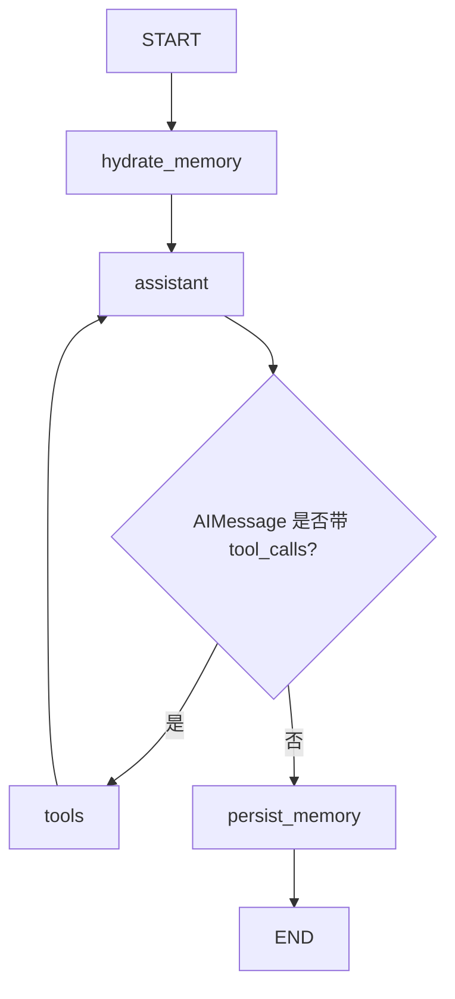

# LangGraph 聊天 Agent 实战

## 适用人群

这份实战适合已经学过 LLM、Prompt、工具调用、Agent 基本概念，并希望进一步做一个更接近真实应用的同学。

## 学习目标

完成这个项目后，你应该能够：

1. 理解 LangGraph 为什么适合搭建 Agent 工作流
2. 理解一个聊天 Agent 如何把聊天、工具、记忆、调度组合起来
3. 自己跑通一个带网页界面的 Agent 小项目
4. 在现有代码上继续扩展更多工具和长期记忆能力

## 目录

1. [这个项目是什么](#1-这个项目是什么)
2. [它解决什么问题](#2-它解决什么问题)
3. [为什么这次要用 LangGraph](#3-为什么这次要用-langgraph)
4. [项目目标与最终效果](#4-项目目标与最终效果)
5. [核心能力拆解](#5-核心能力拆解)
6. [LangGraph 中的节点调度](#6-langgraph-中的节点调度)
7. [项目代码结构](#7-项目代码结构)
8. [如何运行项目](#8-如何运行项目)
9. [你需要重点观察什么](#9-你需要重点观察什么)
10. [常见误区与失败原因](#10-常见误区与失败原因)
11. [实战练习题](#11-实战练习题)
12. [参考答案与思考方向](#12-参考答案与思考方向)
13. [总结与下一步建议](#13-总结与下一步建议)

## 1. 这个项目是什么

这是一个基于 LangGraph 的自定义聊天 Agent。

它不是一个“只会单轮回复”的聊天机器人，而是一个带工作流结构的 Agent：

- 可以和用户多轮聊天
- 可以调用外部工具
- 可以记住用户之前说过的话
- 可以根据当前状态决定下一步走哪个节点

为了让这个项目更接近真实应用，我们还给它做了一个简单网页界面，方便你直接在浏览器里体验。

## 2. 它解决什么问题

很多人在学 Agent 时，会碰到一个问题：

普通聊天机器人看起来也能聊天，那为什么还要单独学 Agent？

因为真实任务里，模型往往不只是“生成一句回答”，而是要在下面这些动作之间切换：

1. 先理解用户当前意图
2. 判断要不要调用工具
3. 如果要调用，决定该调哪个工具
4. 拿到工具结果后，再继续组织回答
5. 把关键用户信息写进记忆，方便下次继续使用

如果这些逻辑全都堆在一段代码里，会很快变乱。

LangGraph 的价值就在这里：

**它帮助你把 Agent 拆成节点和边，让“聊天、工具、记忆、调度”变成一个看得见、能扩展、能调试的图结构。**

## 3. 为什么这次要用 LangGraph

前面的最小 Agent 项目更适合理解流程思想，但当你开始加入：

- 多轮消息
- 工具节点
- 记忆节点
- 条件路由
- 网页接口

你会发现，只靠一个 `while` 循环或者一串 `if/else` 会越来越难维护。

LangGraph 特别适合这个阶段，因为它有几个优点。

### 3.1 节点职责更清楚

你可以把不同阶段拆成不同节点，例如：

- 读取记忆
- 生成下一步决策
- 执行工具
- 持久化记忆

### 3.2 条件路由更自然

例如：

- 如果模型输出了工具调用，就去 `tools` 节点
- 如果已经有最终回答，就去 `persist_memory`

这就是 Agent 的“调度”能力。

### 3.3 后面更容易升级

这个项目后面很容易继续升级成：

- 接入 Google Calendar
- 接入 Tavily / SerpAPI 搜索
- 接入数据库或 RAG 知识库
- 加入更强的用户画像提取
- 接入多 Agent 协作

## 4. 项目目标与最终效果

### 最终你会得到什么

你会得到一个可以在浏览器里打开的聊天 Agent 页面。

这个 Agent 支持：

1. 和用户聊天
2. 记住用户信息
3. 查询天气
4. 搜索公开网络信息
5. 创建和查看日程

### 输入示例

```text
我叫小陈，请记住我在上海工作。
```

```text
帮我查一下上海天气。
```

```text
帮我创建 产品评审会议 从2026-03-25 14:00到2026-03-25 15:00
```

### 输出效果

你不仅能看到最终回答，还能在代码里明确看到：

- 记忆从哪里读取
- 工具在哪里注册
- 工具什么时候被调用
- 节点是如何被路由的

## 5. 核心能力拆解

这个项目想重点体现 4 个能力。

### 5.1 聊天能力

这是最表层的能力。

用户在网页里输入一句话，Agent 要根据上下文生成合理回复。

但真正关键的是：

**聊天只是入口，不是全部。**

### 5.2 工具能力

当用户问：

- 某个城市天气
- 某个主题的公开信息
- 今天有哪些日程

这时候仅靠模型内部知识不够，Agent 应该调用工具。

当前项目默认内置 4 个工具：

1. `web_search`
2. `get_weather`
3. `calendar_add_event`
4. `calendar_list_events`

### 5.3 记忆能力

很多初学者会把“上下文里还带着前文”误以为是长期记忆。

其实不是。

上下文只是“这次请求还没丢”，而真正的记忆通常意味着：

- 能跨轮次继续使用
- 能跨页面刷新继续使用
- 最好能跨服务重启继续保留

这个项目里，记忆分两层：

1. `MemorySaver`：保存图运行过程中的状态
2. 本地 JSON 文件：保存长期记忆和用户画像

### 5.4 调度能力

这是这个项目最值得你观察的部分。

所谓调度，不是一个抽象名词，而是下面这件事：

1. 先进入 `assistant` 节点
2. 如果需要工具，就路由到 `tools`
3. 工具执行完，再回到 `assistant`
4. 如果已经得到最终回答，就进入 `persist_memory`

这就是一个最小但完整的 Agent 图调度闭环。

## 6. LangGraph 中的节点调度

项目中的主流程可以理解成下面这个图：



这里最核心的不是“图很复杂”，而是你第一次能非常清楚地看到：

- 记忆节点在前面
- 工具节点在中间循环
- 持久化节点在最后收尾

你后面如果还要加：

- 审核节点
- 反思节点
- 安全检查节点
- 多工具并发节点

都可以继续往这个图里加。

## 7. 项目代码结构

项目目录如下：

```text
07-项目实战/agent-chat-langgraph/
├── README.md
├── app.py
├── requirements.txt
├── data/
│   ├── calendar.json
│   └── memory/
└── static/
    └── index.html
```

其中：

- `app.py`：FastAPI 服务、LangGraph 工作流、工具注册、记忆逻辑
- `static/index.html`：网页聊天界面
- `requirements.txt`：依赖列表
- `data/memory/`：每个会话的长期记忆文件
- `data/calendar.json`：本地日历数据

## 8. 如何运行项目

在项目目录下执行：

```bash
cd 07-项目实战/agent-chat-langgraph
pip install -r requirements.txt
python3 app.py
```

然后打开：

```text
http://127.0.0.1:8000
```

如果你想接入真实模型，可以设置：

```bash
export OPENAI_API_KEY=你的Key
export OPENAI_BASE_URL=https://api.openai.com/v1
export OPENAI_MODEL=gpt-4o-mini
```

说明：

1. 配了 Key：更像真实 Agent，模型会自主决定是否调用工具
2. 不配 Key：进入本地教学模式，但依然能演示工作流结构

## 9. 你需要重点观察什么

第一次跑这个项目时，不要只看“界面是不是能聊天”，而是重点看下面几点。

### 9.1 记忆从哪里来

看 `hydrate_memory` 节点，它会在每轮对话开始前，把用户历史记忆读回来。

### 9.2 工具怎么被组织起来

看 `_register_default_tools()`，你会发现工具不是散落在各处，而是统一注册到工具集合里。

### 9.3 调度是怎么发生的

看 `route_after_assistant()`，你会发现所谓调度，本质上就是：

- 看当前状态
- 决定下一条边走向哪里

### 9.4 长期记忆如何落盘

看 `persist_memory()` 和 `PersistentMemoryStore`，你会看到 Agent 如何把用户信息和最近对话摘要写进本地文件。

## 10. 常见误区与失败原因

### 10.1 把“带上下文”误当成“有记忆”

如果一刷新页面就什么都不记得，那其实只是上下文，不是真正长期记忆。

### 10.2 工具做了，但模型不会用

很多项目只是把工具函数写出来，却没有让模型在合适的时候调用它们。

所以你要同时关注：

- 工具定义
- 工具注册
- 提示词里的工具使用规则
- 条件路由

### 10.3 节点越来越多，但职责不清

图不是越复杂越好。

如果一个节点既负责工具判断，又负责写记忆，又负责格式化输出，后面会很难维护。

### 10.4 一开始就接太多真实外部系统

例如：

- Google Calendar OAuth
- 复杂搜索 API
- 企业鉴权

这些都很有价值，但不适合在第一版就一起接入。

这个项目先用“本地可跑 + 接口可扩展”的方式，更适合教学和迭代。

## 11. 实战练习题

建议你在这个项目上继续做 4 个练习。

1. 增加一个“删除日程”的工具
2. 给记忆增加“用户目标”和“偏好语言”字段
3. 接入真正的搜索 API，而不是只用当前默认实现
4. 增加一个“复盘节点”，让 Agent 在回答前检查是否遗漏了工具结果

## 12. 参考答案与思考方向

这里不给你完整代码答案，而给你更重要的实现方向。

### 练习 1：删除日程

思路：

1. 在 `CalendarStore` 里增加删除方法
2. 新增 `calendar_delete_event` 工具
3. 注册工具
4. 在提示词里告诉模型什么时候该调用它

### 练习 2：增强记忆字段

思路：

1. 在 `extract_facts()` 里加规则
2. 让 `persist_memory()` 继续把这些信息写回文件
3. 在系统提示词里把这些字段带回模型

### 练习 3：真实搜索 API

思路：

1. 把 `web_search` 替换成 Tavily、SerpAPI 或自建搜索网关
2. 给工具结果加来源和时间
3. 让回答尽量引用工具返回信息，而不是只凭模型自己概括

### 练习 4：复盘节点

思路：

你可以在 `assistant` 和 `persist_memory` 之间加一个 `review` 节点，让它检查：

- 回答里有没有真的使用工具结果
- 是否漏掉了用户明确提出的要求
- 是否应该把某些内容记入长期记忆

## 13. 总结与下一步建议

这个项目很适合作为从“最小 Agent”迈向“真实应用 Agent”的桥梁。

你会真正看到：

- 聊天只是入口
- 工具让 Agent 接触外部世界
- 记忆让 Agent 具备连续性
- 调度让 Agent 不只是一次性生成

下一步建议你继续升级 3 个方向：

1. 把本地日历换成真实日历 API
2. 把规则式记忆提取换成 LLM 结构化抽取
3. 在图中加入审核、反思或多 Agent 节点

当你把这 3 步继续做下去，这个项目就会从“教学示例”慢慢长成一个真正可扩展的 Agent 应用。
