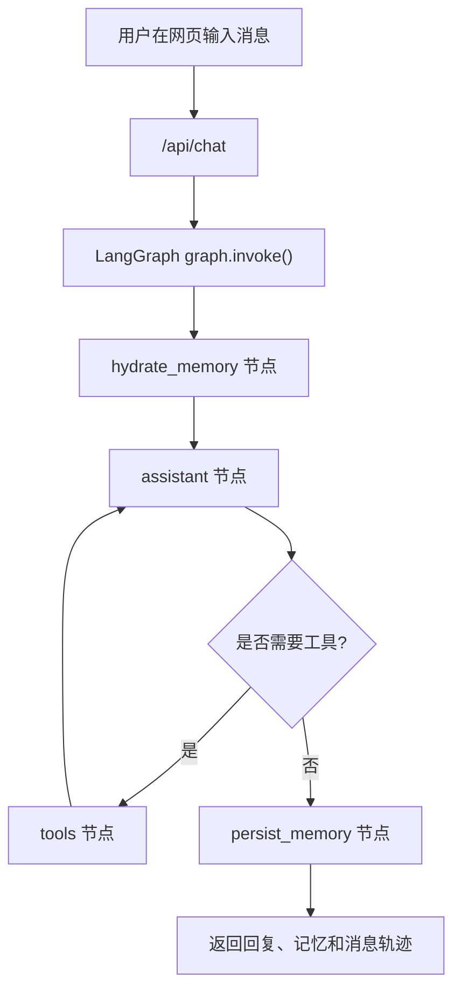
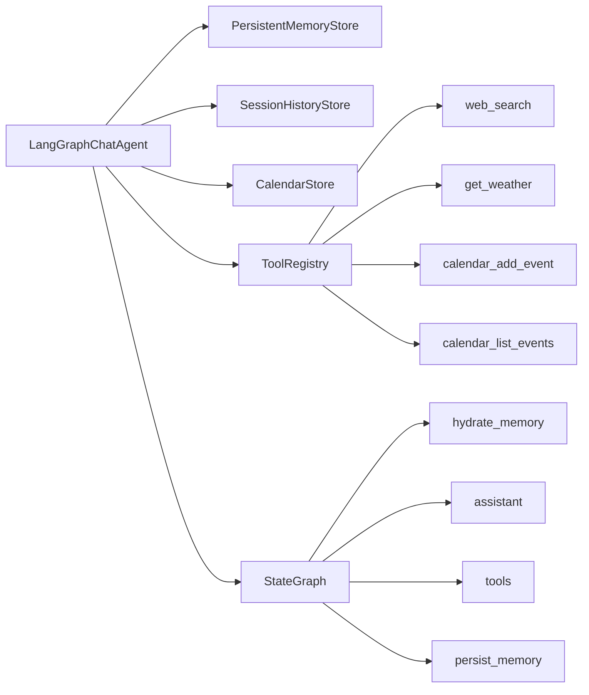

# LangGraph 聊天 Agent

## 目录

1. [项目解决什么问题](#1-项目解决什么问题)
2. [为什么这个项目适合当前学习阶段](#2-为什么这个项目适合当前学习阶段)
3. [前置知识](#3-前置知识)
4. [学习目标](#4-学习目标)
5. [核心架构与流程](#5-核心架构与流程)
6. [运行方式](#6-运行方式)
7. [推荐观察点](#7-推荐观察点)
8. [常见失败原因](#8-常见失败原因)
9. [练习任务](#9-练习任务)
10. [下一步延伸](#10-下一步延伸)

## 1. 项目解决什么问题

这是一个使用 LangGraph 搭建的自定义聊天 Agent 教学项目。

它要解决的不是“做一个聊天网页”，而是展示：

1. 多轮聊天如何管理状态
2. 工具调用如何进入图式流程
3. 记忆如何分层管理
4. 节点调度如何替代一大段 `if/else`

## 2. 为什么这个项目适合当前学习阶段

这个项目适合作为**单 Agent 入门项目**，因为它把很多 Agent 概念都压缩到了一个足够小、又足够完整的例子里：

- 有对话
- 有工具
- 有短期记忆和长期记忆
- 有清晰节点
- 有网页界面方便观察

如果你已经学过 `05-Agent`，这是很适合拿来理解“结构化 Agent”而不是“黑箱 Agent”的项目。

## 3. 前置知识

建议先完成：

1. [04-工具调用与函数调用/README.md](/Users/chenmingdong01/Documents/AI/agent/04-工具调用与函数调用/README.md)
2. [05-Agent/README.md](/Users/chenmingdong01/Documents/AI/agent/05-Agent/README.md)

如果还没接触过 LangGraph，建议先看：

- [3.LangGraph聊天Agent实战.md](/Users/chenmingdong01/Documents/AI/agent/07-项目实战/3.LangGraph聊天Agent实战.md)

## 4. 学习目标

完成这个项目后，你应该能够：

1. 理解 LangGraph 为什么适合做 Agent 编排
2. 理解聊天、工具、记忆、持久化是怎样串起来的
3. 读懂一个最小图式 Agent 的执行链路
4. 知道如何继续扩展审核、安全检查或更多工具

## 5. 核心架构与流程

### 5.1 这个项目的核心能力

它包含 4 个核心能力：

1. 多轮聊天
2. 工具调用
3. 长短期记忆
4. 图节点调度

### 5.2 记忆是怎么分层的

当前项目把记忆拆成了 3 层：

1. 短期记忆
   由 `MemorySaver` 负责，保存当前图执行过程中的状态和消息
2. 长期记忆
   由 `PersistentMemoryStore` 负责，只保存用户事实、偏好、备注和摘要
3. 会话日志
   由 `SessionHistoryStore` 负责，保存完整对话原文

### 5.3 主流程图



### 5.4 模块关系图



默认工具包括：

- `web_search`
- `get_weather`
- `calendar_add_event`
- `calendar_list_events`

## 6. 运行方式

先安装依赖：

```bash
pip install -r requirements.txt
```

然后启动：

```bash
python3 app.py
```

或者：

```bash
uvicorn app:app --reload
```

启动后打开：

```text
http://127.0.0.1:8000
```

### 可选：接入 OpenAI 兼容模型

如果你配置了 API Key，Agent 会使用真实模型进行工具决策和回答生成：

```bash
export OPENAI_API_KEY=你的Key
export OPENAI_BASE_URL=https://api.openai.com/v1
export OPENAI_MODEL=gpt-4o-mini
```

如果没有配置 `OPENAI_API_KEY`，程序会进入本地教学模式。

## 7. 推荐观察点

建议重点观察下面几个点：

1. `hydrate_memory` 在真正回答前做了什么
2. `assistant` 是如何判断是否需要工具的
3. 工具节点返回后，为什么又要回到 `assistant`
4. 长期记忆、会话日志、短期图状态为什么不能混在一起
5. 这个图结构未来如果加审核节点，应该放在哪里

## 8. 常见失败原因

最常见的失败通常不在“模型不够强”，而在：

1. 记忆边界不清，导致脏信息长期残留
2. 工具返回结构不稳定，导致后续节点难以处理
3. 路由条件设计过粗，导致工具该调不调或不该调却调
4. 对话网页能跑，但没有保留足够的调试轨迹

## 9. 练习任务

建议至少做下面 3 个练习：

1. 增加一个新工具，例如待办事项工具
2. 给 `assistant` 增加一个“是否需要先澄清问题”的判断
3. 记录一次失败案例，并说明是记忆、工具还是路由出了问题

## 10. 下一步延伸

如果你已经能读懂这个项目，下一步可以继续做两种升级：

1. 升级成更强调自主决策的 ReAct Agent：
   [agent-study-react/README.md](/Users/chenmingdong01/Documents/AI/agent/07-项目实战/agent-study-react/README.md)
2. 升级成规划与执行分离或多 Agent 协作：
   [agent-planner-executor/README.md](/Users/chenmingdong01/Documents/AI/agent/07-项目实战/agent-planner-executor/README.md)
