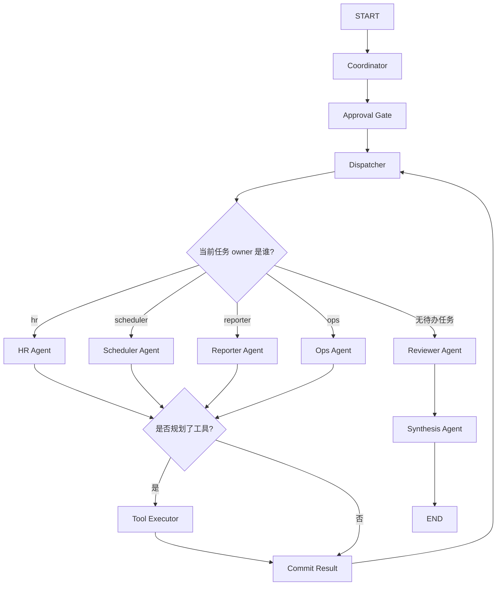

# Multi-Agent 数字员工

这是一个基于 `LangGraph` 的教学型多 Agent 项目。

项目主题是“数字员工”：用户给出一个内部事务请求后，系统会把任务拆给多个角色，并由每个角色通过真实 LLM 请求完成自己的工作。

升级后的版本又往前走了一层：

1. `Coordinator / 专家 Agent / Reviewer / Synthesizer` 都会真实请求 LLM
2. 专家 Agent 会先规划是否需要调用工具
3. `Tool Executor` 会执行本地工具，把结果写入文件
4. 新增 `Approval Gate`，把高风险请求标出来，模拟人工审批前置

核心角色：

1. `Coordinator Agent`：理解请求并拆分子任务
2. `Approval Gate`：识别高风险事项并增加审批提示
3. `Dispatcher Agent`：把任务路由给对应专家
4. `HR Agent`：生成入职与培训计划
5. `Scheduler Agent`：生成会议与培训排期建议
6. `Reporter Agent`：生成给主管的汇报摘要
7. `Tool Executor`：执行本地工具
8. `Reviewer Agent`：补充风险和实现难点说明

## 运行方式

先安装依赖：

```bash
pip install -r requirements.txt
```

再配置真实模型所需环境变量：

```bash
export OPENAI_API_KEY=你的Key
export OPENAI_API_STYLE=chat_completions
export OPENAI_BASE_URL=https://api.chatanywhere.tech
export OPENAI_MODEL=gpt-5-mini
export OPENAI_SSL_VERIFY=false
```

再运行：

```bash
python3 main.py "请以数字员工身份，为新员工小王安排第一周入职计划，并协调周三下午培训会议，最后生成给主管的汇报摘要"
```

或者在仓库根目录运行：

```bash
python3 07-项目实战/agent-digital-employee-multi-agent/main.py "请以数字员工身份，为新员工小王安排第一周入职计划，并协调周三下午培训会议，最后生成给主管的汇报摘要"
```

## 你会看到什么

程序会输出并写入两个文件：

- `output/final_result.md`：最终交付结果
- `output/trace.json`：图执行轨迹和中间状态摘要

同时，运行过程中会真实调用 LLM 来完成：

- `Coordinator Agent` 的任务拆解
- `HR / Scheduler / Reporter / Ops Agent` 的内容生成
- `Reviewer Agent` 的审核
- `Synthesizer Agent` 的最终汇总

如果专家 Agent 规划了工具调用，项目还会额外写入：

- `data/tool_outputs/calendar_events.json`
- `data/tool_outputs/notification_drafts.json`
- `data/tool_outputs/onboarding_*.md`

## 主流程图



## 这个项目重点演示什么

1. 多 Agent 不是“多开几个模型”，而是先把职责拆清楚
2. 各 Agent 要共享同一份状态，否则协作很容易乱
3. LangGraph 的价值在于把节点、边、条件路由都显式画出来
4. Tool Executor 让项目不止生成文案，还能落地本地执行结果
5. Reviewer 节点很重要，它能帮助你暴露真实落地时的难点

## 当前版本的限制

- 已接入真实 LLM，并加入了本地工具执行层，但日历和通知仍然是本地文件模拟
- 还没有接入真实企业 IM、审批系统、权限系统
- `Approval Gate` 目前是教学型模拟，不会真的阻塞并等待人工输入
- 为了教学可读性，Dispatcher 仍是规则路由，不是生产级调度器

## 推荐观察点

1. `OpenAIMultiAgentClient` 如何兼容 `chat_completions / responses`
2. `run_specialist_agent()` 如何让专家 Agent 先规划工具调用
3. `tool_executor_node()` 如何执行本地工具并把结果回注
4. `approval_gate_node()` 如何体现高风险任务前置审批
5. `synthesizer_node()` 如何汇总多 Agent 结果
