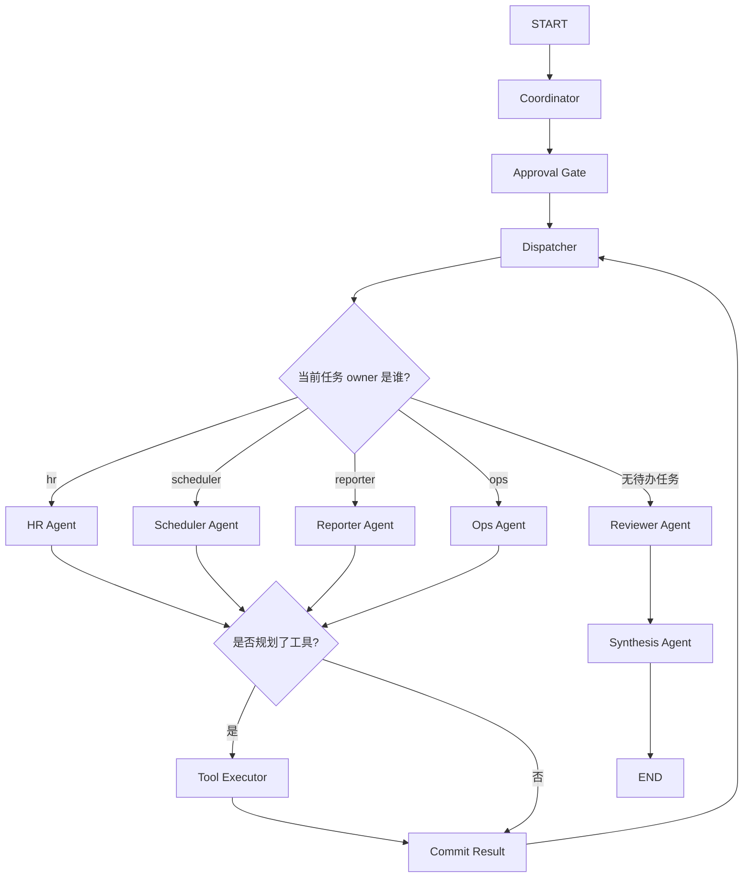

# Multi-Agent 数字员工

## 目录

1. [项目解决什么问题](#1-项目解决什么问题)
2. [为什么这个项目适合当前学习阶段](#2-为什么这个项目适合当前学习阶段)
3. [前置知识](#3-前置知识)
4. [学习目标](#4-学习目标)
5. [核心架构与流程](#5-核心架构与流程)
6. [运行方式](#6-运行方式)
7. [推荐观察点](#7-推荐观察点)
8. [常见失败原因](#8-常见失败原因)
9. [练习任务](#9-练习任务)
10. [下一步延伸](#10-下一步延伸)

## 1. 项目解决什么问题

这是一个基于 `LangGraph` 的教学型多 Agent 项目。

项目主题是“数字员工”：用户给出一个内部事务请求后，系统会把任务拆给多个角色，并由每个角色通过真实 LLM 请求完成自己的工作。

它重点演示的不是“多开几个模型”，而是：

1. 角色如何拆分
2. 状态如何共享
3. 工具执行如何进入多 Agent 链路
4. 高风险请求如何增加审批门

## 2. 为什么这个项目适合当前学习阶段

这个项目适合作为**多 Agent 协作的教学项目**，前提是你已经理解单 Agent 和规划执行分离。

它比普通 Agent 更复杂的地方在于：

- 有多个角色
- 有共享状态
- 有工具执行层
- 有审核和汇总环节

如果你还没建立“职责拆分”和“错误会跨角色传递”的意识，这个项目会帮你把这些问题看清楚。

## 3. 前置知识

建议先完成：

1. [05-Agent/README.md](/Users/chenmingdong01/Documents/AI/agent/05-Agent/README.md)
2. [06-评测与优化/README.md](/Users/chenmingdong01/Documents/AI/agent/06-评测与优化/README.md)
3. [agent-planner-executor/README.md](/Users/chenmingdong01/Documents/AI/agent/07-项目实战/agent-planner-executor/README.md)

配套讲义建议先看：

- [6.Multi-Agent数字员工实战.md](/Users/chenmingdong01/Documents/AI/agent/07-项目实战/6.Multi-Agent数字员工实战.md)

## 4. 学习目标

完成这个项目后，你应该能够：

1. 理解多 Agent 不等于多开几个模型
2. 理解 Dispatcher、Reviewer、Synthesizer 等角色的分工
3. 理解共享状态在协作系统里的重要性
4. 观察工具执行和审批门如何改变链路稳定性

## 5. 核心架构与流程

核心角色包括：

1. `Coordinator Agent`
2. `Approval Gate`
3. `Dispatcher Agent`
4. `HR Agent`
5. `Scheduler Agent`
6. `Reporter Agent`
7. `Tool Executor`
8. `Reviewer Agent`

### 主流程图



### 这个项目重点演示什么

1. 多 Agent 不是“多开几个模型”，而是先把职责拆清楚
2. 各 Agent 要共享同一份状态，否则协作很容易乱
3. `Tool Executor` 让项目不止生成文案，还能落地本地执行结果
4. `Reviewer` 节点帮助你暴露真实落地时的难点

## 6. 运行方式

先安装依赖：

```bash
pip install -r requirements.txt
```

再配置真实模型所需环境变量：

```bash
export OPENAI_API_KEY=你的Key
export OPENAI_API_STYLE=chat_completions
export OPENAI_BASE_URL=https://api.chatanywhere.tech
export OPENAI_MODEL=gpt-5-mini
export OPENAI_SSL_VERIFY=false
```

再运行：

```bash
python3 main.py "请以数字员工身份，为新员工小王安排第一周入职计划，并协调周三下午培训会议，最后生成给主管的汇报摘要"
```

或者在仓库根目录运行：

```bash
python3 07-项目实战/agent-digital-employee-multi-agent/main.py "请以数字员工身份，为新员工小王安排第一周入职计划，并协调周三下午培训会议，最后生成给主管的汇报摘要"
```

程序会输出并写入：

- `output/final_result.md`
- `output/trace.json`

## 7. 推荐观察点

建议重点观察：

1. `Coordinator` 如何拆任务
2. `Approval Gate` 如何识别高风险请求
3. `Dispatcher` 如何把任务路由到不同专家
4. `tool_executor_node()` 如何执行本地工具并回注结果
5. `synthesizer_node()` 如何汇总多角色结果

## 8. 常见失败原因

多 Agent 项目最常见的问题通常有：

1. 角色边界不清，多个 Agent 在做重复工作
2. 共享状态字段设计混乱，导致后续节点理解错上下文
3. 工具结果没有被标准化，导致 Reviewer 或 Synthesizer 难以消费
4. 高风险请求只做标记，不做真正阻断，容易让学习者误判系统安全性

## 9. 练习任务

建议做下面 3 个练习：

1. 新增一个专家角色，例如 `Finance Agent`
2. 给 `Approval Gate` 增加更明确的风险分类字段
3. 记录一次角色协作失败案例，并说明问题发生在哪个节点

## 10. 下一步延伸

如果你已经理解了这个项目，下一步建议回到：

1. [06-评测与优化/README.md](/Users/chenmingdong01/Documents/AI/agent/06-评测与优化/README.md)
2. [11-模拟面试/README.md](/Users/chenmingdong01/Documents/AI/agent/11-模拟面试/README.md)

把多 Agent 项目的失败链路、架构取舍和评测口径整理成可对外讲述的内容。
