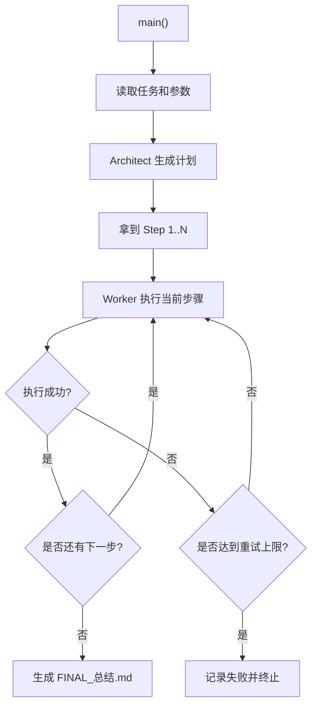

# 架构师与工人 Agent

这是一个使用 Planner-Executor 模式的教学型 Agent 项目。

它把 Agent 明确拆成两个角色：

1. `Architect`：负责先生成完整计划
2. `Worker`：负责按计划逐步执行

这个项目默认围绕“生成一套学习资料包”展开，方便你直接看到文件级产出。

## 运行方式

在项目目录下运行：

```bash
python3 main.py "Planner-Executor 模式入门"
```

或者在仓库根目录运行：

```bash
python3 07-项目实战/agent-planner-executor/main.py "Planner-Executor 模式入门"
```

你也可以指定受众和输出目录：

```bash
python3 07-项目实战/agent-planner-executor/main.py "Agent 稳定性设计" --audience "初学者" --output-dir ./pe-output
```

## 可选：接入 OpenAI API

如果你已经有 API Key，可以先设置：

```bash
export OPENAI_API_KEY=你的Key
export OPENAI_BASE_URL=https://api.openai.com
export OPENAI_MODEL=gpt-5-mini
export OPENAI_API_STYLE=responses
export OPENAI_SSL_VERIFY=true
```

说明：

- 未配置 Key 时，程序会自动回退到本地教学模式
- 配置 Key 后，会优先让真实模型分别扮演“架构师”和“工人”
- 程序支持 `responses` 和 `chat_completions` 两种接口风格

## 你会看到什么

程序会依次输出：

1. 结构化计划
2. 每一步执行状态
3. 失败重试日志
4. 最终总结文件位置

默认产物包括：

- `01_任务定义.md`
- `02_学习大纲.md`
- `03_核心概念.md`
- `04_练习题.md`
- `FINAL_总结.md`

## 主流程图



## 模块说明

### `OpenAIPlannerExecutorClient`

负责：

- 读取环境变量
- 按接口风格发起请求
- 分别调用架构师与工人
- 在失败时回退到本地教学模式

### `Architect`

负责：

- 把总任务拆成详细步骤
- 定义每一步的目标文件和完成标准

### `Worker`

负责：

- 读取单个步骤
- 生成对应内容
- 写入目标文件

### `PlannerExecutorAgent`

负责：

- 串联整体流程
- 跟踪步骤状态
- 对失败步骤重试
- 汇总最终结果

## 推荐观察点

1. 架构师产出的计划是否足够细
2. 工人是否严格按计划执行
3. 某一步失败时是否只重试当前步骤
4. 最终产物是否真的写入到了输出目录
