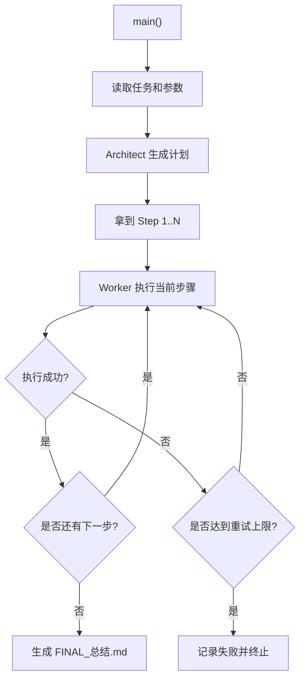

# 架构师与工人 Agent

## 目录

1. [项目解决什么问题](#1-项目解决什么问题)
2. [为什么这个项目适合当前学习阶段](#2-为什么这个项目适合当前学习阶段)
3. [前置知识](#3-前置知识)
4. [学习目标](#4-学习目标)
5. [核心架构与流程](#5-核心架构与流程)
6. [运行方式](#6-运行方式)
7. [推荐观察点](#7-推荐观察点)
8. [常见失败原因](#8-常见失败原因)
9. [练习任务](#9-练习任务)
10. [下一步延伸](#10-下一步延伸)

## 1. 项目解决什么问题

这是一个使用 Planner-Executor 模式的教学型 Agent 项目。

它要解决的核心问题是：

**当任务较复杂时，为什么“先规划，再执行”往往比让一个 Agent 直接边想边做更稳。**

项目把 Agent 明确拆成两个角色：

1. `Architect`：负责先生成完整计划
2. `Worker`：负责按计划逐步执行

## 2. 为什么这个项目适合当前学习阶段

这个项目适合作为**单 Agent 向多步任务系统过渡**的项目。  
它比普通单 Agent 更强调：

- 任务拆解
- 计划质量
- 失败重试的颗粒度

如果你已经理解了普通聊天 Agent，但还没真正理解“规划和执行不是一回事”，这个项目非常关键。

## 3. 前置知识

建议先完成：

1. [05-Agent/README.md](/Users/chenmingdong01/Documents/AI/agent/05-Agent/README.md)
2. [06-评测与优化/README.md](/Users/chenmingdong01/Documents/AI/agent/06-评测与优化/README.md)

配套讲义建议先看：

- [5.架构师与工人Agent实战.md](/Users/chenmingdong01/Documents/AI/agent/07-项目实战/5.架构师与工人Agent实战.md)

## 4. 学习目标

完成这个项目后，你应该能够：

1. 理解 Planner-Executor 模式为什么常用于复杂任务
2. 识别计划质量对整体结果的影响
3. 理解失败时为什么只重试当前步骤更可控
4. 知道如何把任务产物写成可观察的文件输出

## 5. 核心架构与流程

这个项目默认围绕“生成一套学习资料包”展开，方便你直接看到文件级产出。

### 主流程图



### 模块说明

#### `OpenAIPlannerExecutorClient`

负责：

- 读取环境变量
- 按接口风格发起请求
- 分别调用架构师与工人
- 在失败时回退到本地教学模式

#### `Architect`

负责：

- 把总任务拆成详细步骤
- 定义每一步的目标文件和完成标准

#### `Worker`

负责：

- 读取单个步骤
- 生成对应内容
- 写入目标文件

#### `PlannerExecutorAgent`

负责：

- 串联整体流程
- 跟踪步骤状态
- 对失败步骤重试
- 汇总最终结果

## 6. 运行方式

在项目目录下运行：

```bash
python3 main.py "Planner-Executor 模式入门"
```

或者在仓库根目录运行：

```bash
python3 07-项目实战/agent-planner-executor/main.py "Planner-Executor 模式入门"
```

你也可以指定受众和输出目录：

```bash
python3 07-项目实战/agent-planner-executor/main.py "Agent 稳定性设计" --audience "初学者" --output-dir ./pe-output
```

### 可选：接入 OpenAI API

```bash
export OPENAI_API_KEY=你的Key
export OPENAI_BASE_URL=https://api.openai.com
export OPENAI_MODEL=gpt-5-mini
export OPENAI_API_STYLE=responses
export OPENAI_SSL_VERIFY=true
```

## 7. 推荐观察点

建议重点看：

1. 架构师产出的计划是否足够细
2. 工人是否严格按计划执行
3. 某一步失败时是否只重试当前步骤
4. 最终产物是否真的写入了输出目录
5. 本地回退模式和真实 LLM 模式的行为差异

## 8. 常见失败原因

最常见的问题有：

1. `Architect` 计划太粗，导致 `Worker` 无法稳定执行
2. 计划和输出文件没有明确定义，结果很难验证
3. 失败重试粒度太大，重复做了不必要的工作
4. 项目只看最终产物，不看中间步骤状态

## 9. 练习任务

建议做下面 3 个练习：

1. 增加一个新的步骤类型，例如“生成评测清单”
2. 给每一步增加更明确的完成标准
3. 设计一个故意失败的步骤，观察重试机制是否合理

## 10. 下一步延伸

如果你已经理解了规划和执行分离，下一步可以继续升级到：

1. 更自主的 ReAct Agent：
   [agent-study-react/README.md](/Users/chenmingdong01/Documents/AI/agent/07-项目实战/agent-study-react/README.md)
2. 更复杂的多角色协作：
   [agent-digital-employee-multi-agent/README.md](/Users/chenmingdong01/Documents/AI/agent/07-项目实战/agent-digital-employee-multi-agent/README.md)
