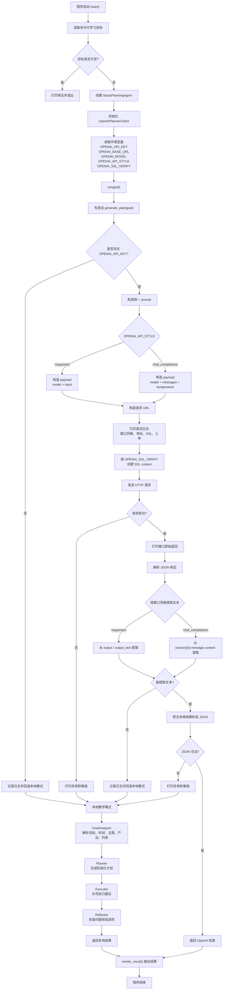
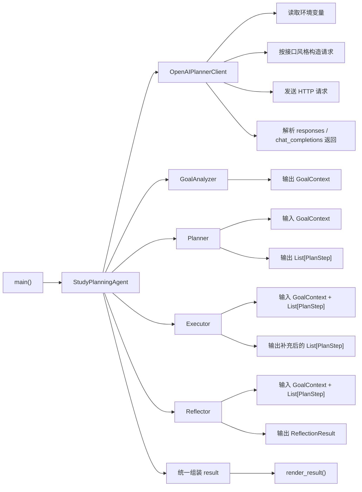

# 学习任务拆解 Agent

这是一个适合入门的最小 Agent 项目。

它接收一个学习目标，然后依次完成：

1. 目标分析
2. 任务规划
3. 执行建议生成
4. 计划反思与修正

## 运行方式

```bash
python3 main.py "一周内完成 Agent 基础学习，并做一个最小 Demo"
```

或者在仓库根目录运行：

```bash
python3 07-项目实战/agent-study-planner/main.py "一周内完成 Agent 基础学习，并做一个最小 Demo"
```

## 可选：接入 OpenAI API

如果你已经有 API Key，可以先设置：

```bash
export OPENAI_API_KEY=你的Key
export OPENAI_BASE_URL=https://api.chatanywhere.tech
export OPENAI_MODEL=gpt-4o
export OPENAI_API_STYLE=chat_completions
export OPENAI_SSL_VERIFY=false
```

程序支持两种接口风格：

- `responses`
- `chat_completions`

默认使用 `responses`。

调用 LLM 时，程序现在会额外打印：

- 请求地址
- 请求入参
- 接口原始返回
- 异常信息和堆栈

这样更方便你排查代理地址、模型兼容性和返回格式问题。

如果你不设置 `OPENAI_BASE_URL`，默认会使用官方地址：

```bash
https://api.openai.com
```

如果你使用代理或兼容网关，可以像这样配置：

```bash
export OPENAI_BASE_URL=https://api.chatanywhere.tech
export OPENAI_MODEL=gpt-4o-mini
export OPENAI_API_STYLE=chat_completions
```

如果你的代理证书会导致 `CERTIFICATE_VERIFY_FAILED`，可以临时关闭 SSL 校验：

```bash
export OPENAI_SSL_VERIFY=false
```

说明：

- 默认值是 `true`
- 只有在代理证书异常、并且你明确知道风险时，才建议临时设为 `false`
- 关闭后更适合本地调试，不建议长期用于生产环境

模型名也支持通过环境变量覆盖：

```bash
export OPENAI_MODEL=gpt-5-mini
```

说明：

- 默认值是 `gpt-5-mini`
- 如果你的代理或兼容网关只支持某些模型名，可以在这里切换

接口风格也支持通过环境变量覆盖：

```bash
export OPENAI_API_STYLE=responses
```

或者：

```bash
export OPENAI_API_STYLE=chat_completions
```

说明：

- 默认值是 `responses`
- 如果你的代理文档示例是 `messages` + `/v1/chat/completions`，请设置成 `chat_completions`
- 如果你的接口文档示例是 `input` + `/v1/responses`，请设置成 `responses`

如果没有设置 Key，程序会自动回退到本地教学模式，仍然可以完整跑通流程。

## 代码结构理解

### 主流程图



### 模块关系图



### 每个阶段在做什么

1. `OpenAIPlannerClient`
负责读取环境变量、选择接口风格、发请求、打印日志、解析返回。如果 LLM 调用失败，就交回本地模式。

2. `GoalAnalyzer`
把一句自然语言目标拆成结构化上下文，比如主题、时间限制、预期产出、约束条件。

3. `Planner`
根据结构化上下文生成阶段化计划，决定分几步走、每一步做什么。

4. `Executor`
把比较抽象的步骤补成更可执行的动作建议，让计划不只是标题列表。

5. `Reflector`
对计划做一次简单自检，找出时间过载、缺少复盘、产出不清晰等问题。

6. `render_result()`
把最后结果渲染成适合命令行阅读的文本输出。

## 学习重点

建议你重点阅读 `main.py` 里的这些部分：

- `GoalAnalyzer`：看输入如何被解析
- `Planner`：看任务如何被阶段化
- `Executor`：看任务如何变成执行建议
- `Reflector`：看计划如何被自检

## 建议扩展

你可以继续尝试：

1. 保存结果为 Markdown 文件
2. 增加每日可用学习时长
3. 给每个任务打优先级
4. 接入真实搜索或笔记工具
