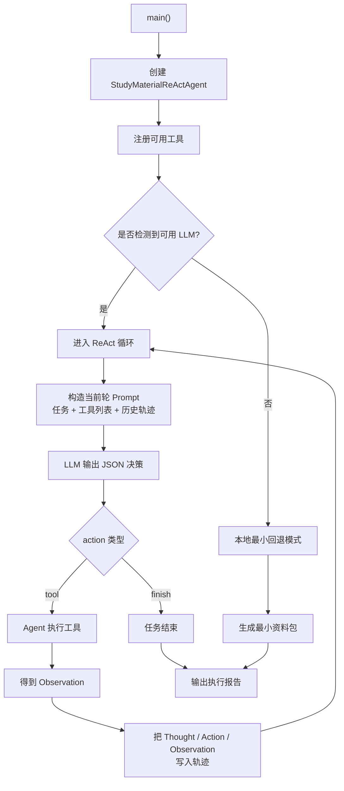
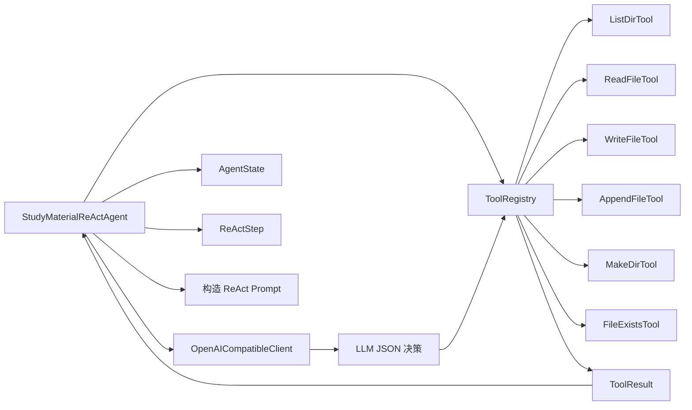

# 学习资料整理 ReAct Agent

这是一个更像真实 Agent 的教学项目。

它不是“让 LLM 先把答案一次性写完”，而是：

1. 给 LLM 一个总任务
2. 让 LLM 每一轮自主思考
3. 让 LLM 自己决定是否调用工具
4. Agent 执行工具，并把结果再交回给 LLM
5. 循环直到 LLM 主动宣布任务完成

这就是更接近真实 Agent 的 ReAct 模式。

## 运行方式

```bash
python3 main.py "RAG 入门" --audience "初学者"
```

指定输出目录：

```bash
python3 main.py "RAG 入门" --audience "初学者" --output /tmp/rag-react-demo
```

## 接入 OpenAI API

```bash
export OPENAI_API_KEY=你的Key
export OPENAI_BASE_URL=https://api.chatanywhere.tech
export OPENAI_MODEL=gpt-4o
export OPENAI_API_STYLE=chat_completions
export OPENAI_SSL_VERIFY=false
```

如果没有配置 `OPENAI_API_KEY`，程序会回退到最小本地模式，仅生成一个入口文档。  
如果配置了 Key，程序会进入真正的 ReAct + 工具循环。

## 主流程图



## 模块关系图



## ReAct 每个阶段在做什么

1. `Thought`
LLM 根据当前任务、可用工具和历史轨迹，思考下一步最应该做什么。

2. `Action`
LLM 选择一个动作：
- 调用工具
- 或直接结束任务

3. `Observation`
Agent 真的去执行工具，并把工具返回值整理成结构化观察结果。

4. `Next Thought`
下一轮 LLM 再根据最新 Observation 继续思考。

所以这个项目的真实循环是：

`Thought -> Action -> Observation -> Thought -> ... -> Finish`

## 工具列表

当前默认注册的工具有：

- `list_dir`：列目录
- `read_file`：读文件
- `write_file`：覆盖写文件
- `append_file`：追加写文件
- `make_dir`：创建目录
- `file_exists`：检查文件或目录是否存在

## 如何扩展工具

这套工具系统是可扩展的。

你只需要：

1. 新建一个继承 `BaseTool` 或 `WorkspaceTool` 的类
2. 给它定义 `spec`
3. 实现 `run(**kwargs)`
4. 在 `StudyMaterialReActAgent._register_default_tools()` 里注册

这样新的工具就会自动进入 ReAct Prompt，LLM 后续就可以自主选择它。

## 你应该重点看哪里

1. [main.py](/Users/chenmingdong01/Documents/AI/agent/07-项目实战/agent-study-react/main.py#L47)
这里是工具协议和状态结构。

2. [main.py](/Users/chenmingdong01/Documents/AI/agent/07-项目实战/agent-study-react/main.py#L252)
这里是 OpenAI 兼容客户端，负责把 ReAct Prompt 发给模型并解析 JSON 决策。

3. [main.py](/Users/chenmingdong01/Documents/AI/agent/07-项目实战/agent-study-react/main.py#L447)
这里是核心 Agent 循环，真正体现“模型决定是否用工具”的地方。
