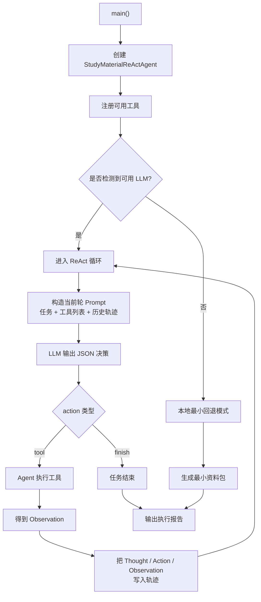
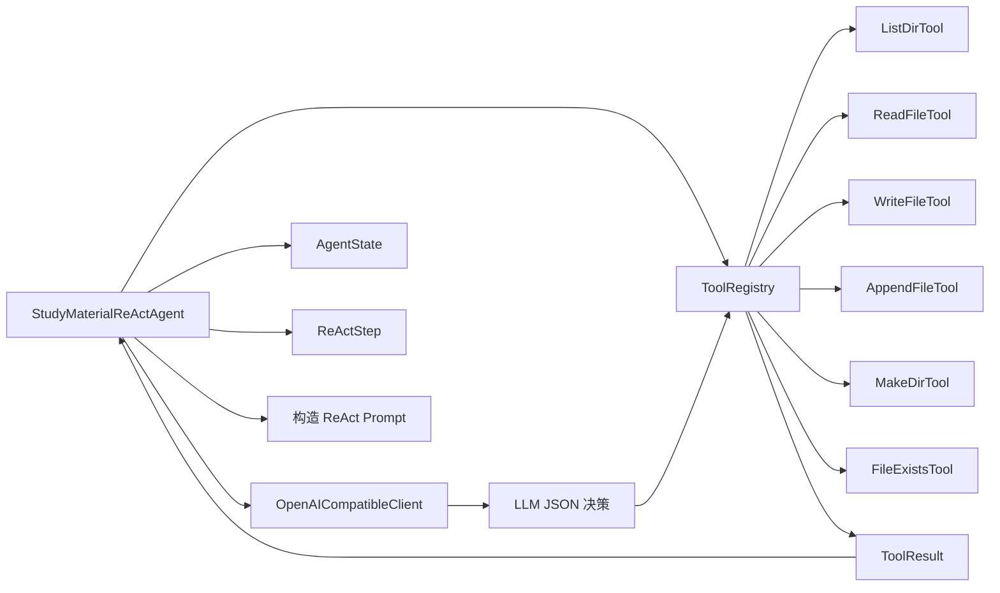

# 学习资料整理 ReAct Agent

## 目录

1. [项目解决什么问题](#1-项目解决什么问题)
2. [为什么这个项目适合当前学习阶段](#2-为什么这个项目适合当前学习阶段)
3. [前置知识](#3-前置知识)
4. [学习目标](#4-学习目标)
5. [核心架构与流程](#5-核心架构与流程)
6. [运行方式](#6-运行方式)
7. [推荐观察点](#7-推荐观察点)
8. [常见失败原因](#8-常见失败原因)
9. [练习任务](#9-练习任务)
10. [下一步延伸](#10-下一步延伸)

## 1. 项目解决什么问题

这是一个更接近真实 Agent 的教学项目。

它不是让 LLM 一次性把答案写完，而是：

1. 给 LLM 一个总任务
2. 让 LLM 每一轮自主思考
3. 让 LLM 自己决定是否调用工具
4. Agent 执行工具，并把结果再交回给 LLM
5. 循环直到 LLM 主动宣布任务完成

这就是更接近真实 Agent 的 ReAct 模式。

## 2. 为什么这个项目适合当前学习阶段

这个项目适合作为**单 Agent 向自主决策 Agent 过渡**的项目。

它比 LangGraph 聊天 Agent 更强调：

- 模型自主决策
- 工具调用循环
- Thought / Action / Observation 轨迹

## 3. 前置知识

建议先完成：

1. [04-工具调用与函数调用/README.md](/Users/chenmingdong01/Documents/AI/agent/04-工具调用与函数调用/README.md)
2. [05-Agent/README.md](/Users/chenmingdong01/Documents/AI/agent/05-Agent/README.md)
3. [agent-chat-langgraph/README.md](/Users/chenmingdong01/Documents/AI/agent/07-项目实战/agent-chat-langgraph/README.md)

## 4. 学习目标

完成这个项目后，你应该能够：

1. 理解 ReAct 模式的基本循环
2. 理解为什么 Thought、Action、Observation 要显式保留
3. 理解模型自主用工具时最容易失控的地方

## 5. 核心架构与流程

### 主流程图



### 模块关系图



## 6. 运行方式

```bash
python3 main.py "RAG 入门" --audience "初学者"
python3 main.py "RAG 入门" --audience "初学者" --output /tmp/rag-react-demo
```

### 接入 OpenAI API

```bash
export OPENAI_API_KEY=你的Key
export OPENAI_BASE_URL=https://api.chatanywhere.tech
export OPENAI_MODEL=gpt-4o
export OPENAI_API_STYLE=chat_completions
export OPENAI_SSL_VERIFY=false
```

如果没有配置 `OPENAI_API_KEY`，程序会回退到最小本地模式。

## 7. 推荐观察点

建议重点看：

1. ReAct Prompt 是怎样把历史轨迹和工具列表一起给模型的
2. 模型输出的 JSON 决策怎样被解析
3. 工具执行结果怎样转成下一轮 Observation
4. 本地回退模式和真实循环之间差了哪些能力

## 8. 常见失败原因

最常见的问题包括：

1. 模型输出格式不稳定，导致 JSON 解析失败
2. 工具集合过多，模型决策噪音变大
3. Observation 写得太差，模型下一轮无法正确利用
4. 没有保留完整轨迹，后期很难复盘失败原因

## 9. 练习任务

建议做下面 3 个练习：

1. 新增一个只读工具，例如“读取某主题目录结构”
2. 故意制造一次工具失败，观察 Agent 是否能继续推进
3. 为轨迹增加一个简单评分维度，辅助后续评测

## 10. 下一步延伸

如果你已经理解 ReAct 单 Agent，可以继续升级到：

1. 规划执行分离：
   [agent-planner-executor/README.md](/Users/chenmingdong01/Documents/AI/agent/07-项目实战/agent-planner-executor/README.md)
2. 多 Agent 协作：
   [agent-digital-employee-multi-agent/README.md](/Users/chenmingdong01/Documents/AI/agent/07-项目实战/agent-digital-employee-multi-agent/README.md)
