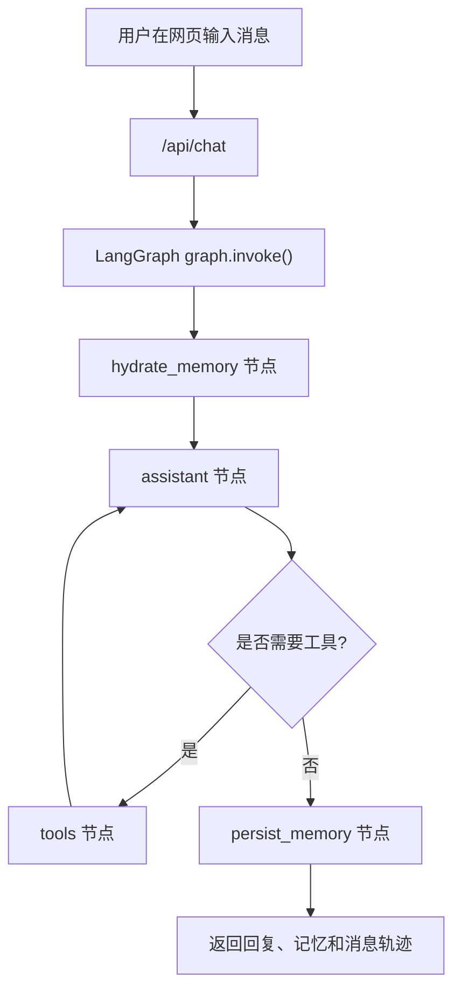
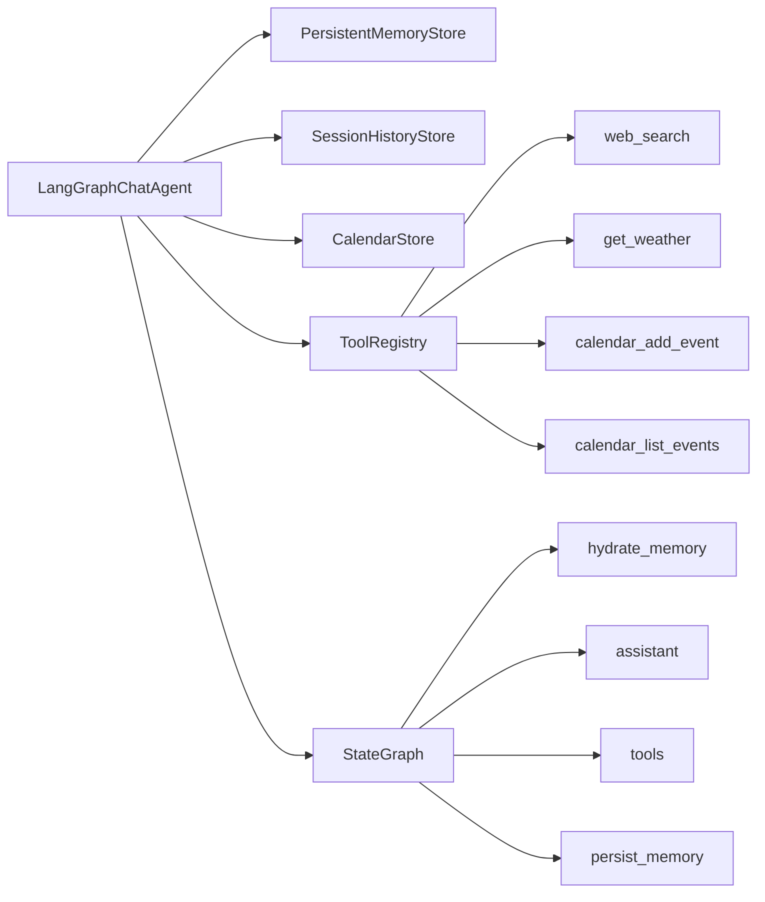

# LangGraph 聊天 Agent

这是一个使用 LangGraph 搭建的自定义聊天 Agent 教学项目。

它包含 4 个核心能力：

1. 多轮聊天
2. 工具调用
3. 长短期记忆
4. 图节点调度

项目默认提供一个简单网页窗口，你可以直接在浏览器里和 Agent 对话。

## 什么是 LangGraph

LangGraph 可以把它理解成一个专门用来搭建 Agent 工作流的流程编排框架。

在这个项目里，Agent 并不是“收到一句话就直接回复”这么简单。它往往要先读取记忆，再判断要不要调用工具，工具执行完之后再继续组织回答，最后还要把新的信息写回记忆。

LangGraph 的作用，就是把这些步骤拆成一个可以管理的图，而不是把所有逻辑都堆进一大段 `if/else` 里。

在当前项目中，你可以把它理解成这样一条流程：

1. 先进入 `hydrate_memory`
2. 再进入 `assistant`
3. 如果需要工具，就去 `tools`
4. 工具执行完，再回到 `assistant`
5. 回答完成后，进入 `persist_memory`

## LangGraph 有哪些功能

LangGraph 在这个项目里主要用到了下面几类能力：

- 节点编排：把流程拆成多个节点，例如 `hydrate_memory`、`assistant`、`tools`、`persist_memory`
- 条件路由：根据当前状态决定下一步走向哪里
- 状态传递：让消息、用户画像、记忆摘要这些信息在节点之间流动
- 工具集成：可以把天气、搜索、日历这类工具接入图流程
- 记忆与检查点：支持多轮对话中的状态保存

## 为什么要使用 LangGraph

因为 Agent 一旦不只是“单轮问答”，复杂度会很快上升。

你很快就会遇到这些问题：

- 什么时候读取记忆
- 什么时候调用工具
- 工具结果回来之后怎么继续生成回答
- 多轮消息怎么保留
- 后面加审核、反思、安全检查时怎么扩展

如果没有一个专门的工作流框架，这些逻辑通常会慢慢变成一团很难维护的流程代码。

LangGraph 的价值就在于，它让 Agent 的执行过程变得结构化、可拆分、可扩展。

## 使用 LangGraph 的好处

在这个项目里，使用 LangGraph 主要有 3 个明显好处：

- 更清晰：每个节点职责明确，读代码时更容易理解 Agent 在做什么
- 更易扩展：今天加工具，明天加审核节点，后面继续升级都比较自然
- 更易调试：当 Agent 出错时，更容易定位是记忆、工具还是路由出了问题

你可以把它和普通脚本对比着理解：

- 普通脚本更像一条从头写到尾的流程
- LangGraph 更像一个显式的任务流图

所以当项目开始涉及聊天、工具、记忆、调度这些能力时，LangGraph 会比纯手写流程控制更适合。

## 功能说明

这个项目想演示的不是“一个普通聊天机器人”，而是一个更接近真实 Agent 的结构：

- 用 `LangGraph` 管理节点和边
- 用 `ToolNode` 执行工具
- 用 `MemorySaver` 保存图运行时状态
- 用本地 JSON 文件分别保存长期记忆和会话日志

## 记忆是怎么分层的

这个项目现在把记忆拆成了 3 层，边界会更清楚：

1. 短期记忆

- 由 `MemorySaver` 负责
- 用来保存当前图执行过程中的状态、消息和工具调用上下文
- 更像“这次会话里刚刚发生了什么”

1. 长期记忆

- 由 `PersistentMemoryStore` 负责
- 只保存用户事实、偏好、备注和摘要
- 例如 `name`、`city`、`likes`、`notes`
- 不直接保存每一轮完整原文

1. 会话日志

- 由 `SessionHistoryStore` 负责
- 专门保存完整对话原文，方便页面回显、调试和后续检索
- 它是持久化数据，但不等同于长期记忆

这样拆开之后，语义会更准确：

- 长期记忆回答“这个用户是谁，有哪些稳定信息”
- 会话日志回答“这个线程最近聊了什么”
- 短期记忆回答“当前这轮图执行到哪一步了”

默认工具包括：

- `web_search`：查公开网络信息
- `get_weather`：查天气
- `calendar_add_event`：添加日程
- `calendar_list_events`：查看日程

## 运行方式

先安装依赖：

```bash
pip install -r requirements.txt
```

然后启动：

```bash
python3 app.py
```

或者：

```bash
uvicorn app:app --reload
```

启动后打开：

```text
http://127.0.0.1:8000
```

## 可选：接入 OpenAI 兼容模型

如果你配置了 API Key，Agent 会使用真实模型进行工具决策和回答生成：

```bash
export OPENAI_API_KEY=你的Key
export OPENAI_BASE_URL=https://api.openai.com/v1
export OPENAI_MODEL=gpt-4o-mini
```

如果没有配置 `OPENAI_API_KEY`，程序会进入本地教学模式：

- 仍然保留 LangGraph 图结构
- 仍然可以演示工具调度
- 仍然可以把用户信息记入本地记忆文件
- 但回复风格会更像规则模式，而不是真实大模型

## 目录结构

```text
langgraph-chat-agent/
├── README.md
├── app.py
├── requirements.txt
├── data/
│   ├── calendar.json
│   ├── memory/
│   └── sessions/
└── static/
    └── index.html
```

## 项目流程图




## 模块关系图




## 推荐测试输入

你可以先试这几句：

1. `我叫小陈，请记住我在上海工作。`
2. `你还记得我刚才说了什么吗？`
3. `帮我查一下上海天气。`
4. `帮我搜索一下 LangGraph 是什么。`
5. `帮我创建 产品评审会议 从2026-03-25 14:00到2026-03-25 15:00`
6. `帮我看看 2026-03-25 的日程`

## 如何扩展工具

如果你想继续加工具，推荐按下面步骤做：

1. 在 `app.py` 里新增一个 `@tool` 函数
2. 在 `_register_default_tools()` 中注册进去
3. 重启服务

只要工具注册到 `ToolRegistry`，它就会自动出现在 Agent 的工具集合中。

例如，你后面可以继续扩展：

- Google Calendar
- 邮件发送
- 飞书或钉钉消息
- 数据库查询
- 企业内部知识库检索

## 你应该重点看哪里

建议按下面这个顺序读：

1. [app.py#L136](/Users/chenmingdong01/Documents/AI/agent/07-项目实战/langgraph-chat-agent/app.py#L136)

这里是 `PersistentMemoryStore`，负责把用户事实、备注、摘要保存到本地 JSON 文件里，它只管“长期记忆”。

1. [app.py#L223](/Users/chenmingdong01/Documents/AI/agent/07-项目实战/langgraph-chat-agent/app.py#L223)

这里是 `SessionHistoryStore`，负责保存完整会话日志。想理解“长期记忆”和“对话原文归档”是怎么分开的，可以接着看这里。

1. [app.py#L359](/Users/chenmingdong01/Documents/AI/agent/07-项目实战/langgraph-chat-agent/app.py#L359)

这里是 `_register_default_tools()`，能看到默认工具是怎么定义和注册的，包括网络搜索、天气查询、添加日程、查看日程。想理解“工具怎么扩展”，重点看这里。

1. [app.py#L513](/Users/chenmingdong01/Documents/AI/agent/07-项目实战/langgraph-chat-agent/app.py#L513)

这里是 `_build_graph()`，是整个 LangGraph 工作流的核心。你可以直接看到 `hydrate_memory -> assistant -> tools/persist_memory` 这条主流程是怎么被拼起来的。

1. [app.py#L554](/Users/chenmingdong01/Documents/AI/agent/07-项目实战/langgraph-chat-agent/app.py#L554)

这里是 `assistant_node()`，负责真正调用 LLM，并把用户画像、记忆摘要和消息历史一起交给模型。想理解“模型如何在上下文里利用记忆和工具”，这里最关键。

1. [app.py#L627](/Users/chenmingdong01/Documents/AI/agent/07-项目实战/langgraph-chat-agent/app.py#L627)

这里是 `persist_memory()`，负责在回答完成后分别写入会话日志和长期记忆。它体现的是“回答结束后怎么收尾，以及不同类型记忆怎么分层落盘”。

1. [app.py#L793](/Users/chenmingdong01/Documents/AI/agent/07-项目实战/langgraph-chat-agent/app.py#L793)

这里是 `invoke()`，相当于整个 Agent 的统一入口。前端请求最终会走到这里，再由这里触发整张图的执行。